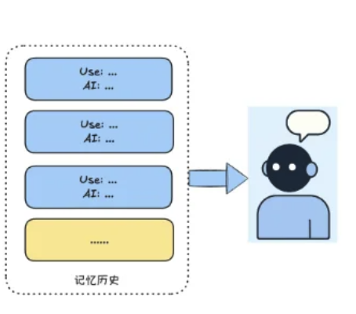

# 8 Common Memory Strategies for AI Agents

Memory is one of the essential capabilities for an **Intelligent Agent**. As conversation length and depth grow, precise understanding and a personalized system depend on how well the agent **remembers** prior context.

> **Note:** **Large language models (LLMs)** have finite **context length**. If memory is not handled carefully, long chats tend to cause:

- **Early context loss** — The model may forget information from the beginning of the thread, which skews understanding.
- **Cost and compute overhead** — Sending unbounded history increases tokens, latency, and spend.

This article walks through **eight** common memory patterns—their ideas, trade-offs, and when they fit—and uses **pseudo-code** where it helps.

---

### 01 — Full history memory: forget nothing

**Description**

**Full history memory** is the simplest pattern: keep **every** user message and assistant reply. Each turn appends to the log; on the next request you pass the **full transcript** to the LLM.

**Basic implementation**

Messages are appended in order to a **dialogue history** (e.g. a list). Each inference call sends that **entire** history as context.

Below is illustrative pseudo-code. *(A typical implementation appends alternating user and assistant strings to a list or buffer.)*

---

### Strategies at a glance (02–08)

The sections below group the remaining patterns by theme. Each entry states the core idea and where it works best.

#### Short-term & context management

- **Full memory (transcript retention)** — **Strategy:** Every prompt and response is stored and sent back with each new query. **Best for:** Short interactions (e.g. fewer than five rounds) when you need high fidelity without much storage design.
- **Sliding window (recent context)** — **Strategy:** Keep only the *N* most recent turns or a fixed token budget; drop older messages. **Best for:** Longer, simple chats when you must stay within token limits but still want local continuity.
- **Summary compression (state management)** — **Strategy:** Periodically summarize the thread and keep a **memory digest** instead of the raw transcript. **Best for:** Long-running conversations where the theme matters more than exact wording.

#### Long-term & persistent memory

- **Vector database (episodic memory)** — **Strategy:** Embed past interactions and store them in a vector DB (e.g. Pinecone, Milvus); retrieve by semantic similarity. **Best for:** “Last time this happened…” recall from similar situations.
- **Knowledge graphs (semantic memory)** — **Strategy:** Store **entities** (e.g. User, Project) and **relations** for structured queries beyond pure similarity. **Best for:** Domains that need precise relationships (e.g. clinical workflows, complex CRM).

#### Advanced & hybrid strategies

- **Hierarchical memory (tiered architecture)** — **Strategy:** Split memory into layers—a small fast tier (e.g. Redis) and a large slow tier (vector DB or SQL). **Best for:** Systems that need low-latency turns *and* deep archives (similar in spirit to OS-style memory in approaches such as Letta).
- **Entity / profile memory (personalization)** — **Strategy:** A dedicated long-term slice for preferences, roles, constraints, and past choices. **Best for:** Assistants, tutors, or agents with returning users.
- **Relevance filtering (contextual cleanup)** — **Strategy:** Before injection, rank or filter memories by relevance (e.g. decay, scoring) and drop stale items. **Best for:** Cutting token load and sharpening answers in noisy, information-rich settings.