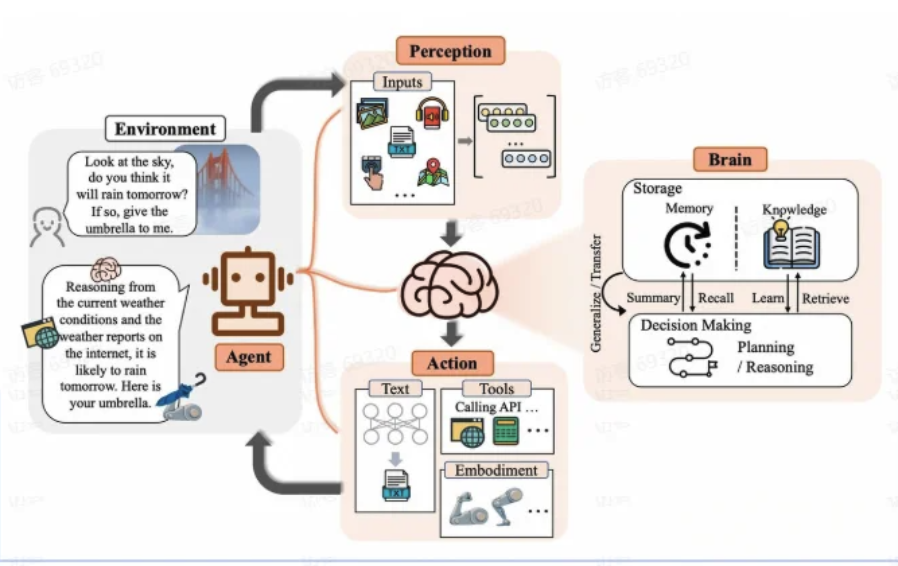
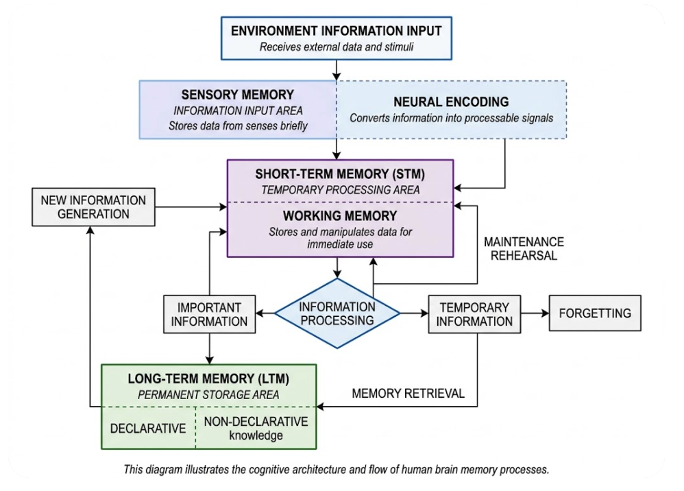
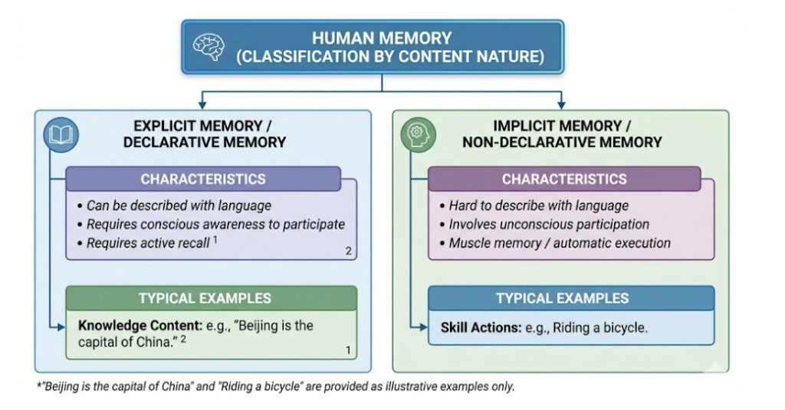
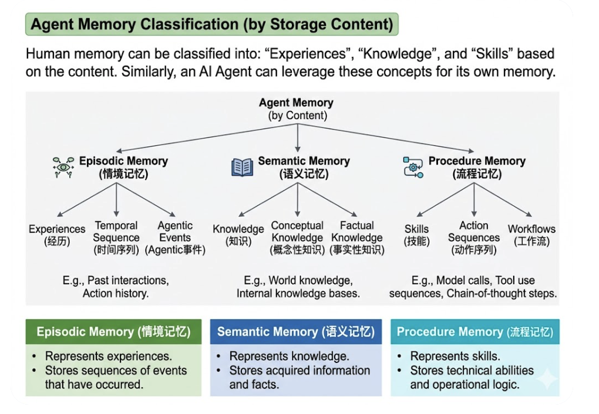
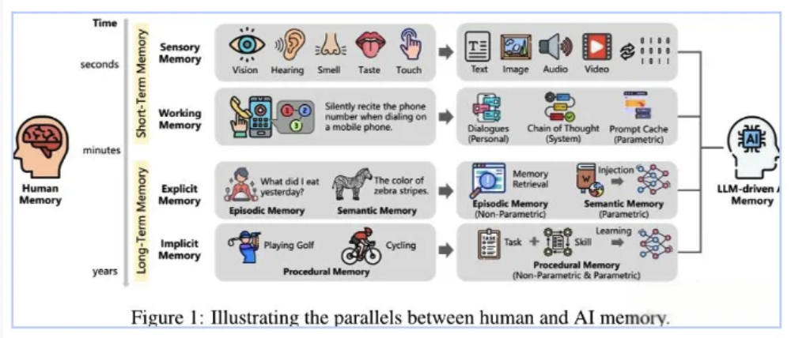
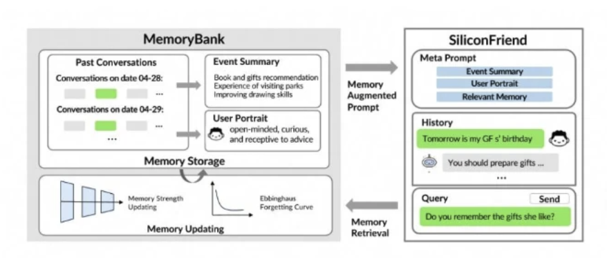
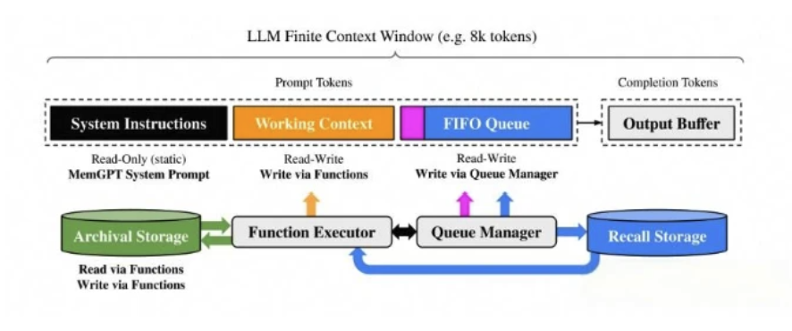
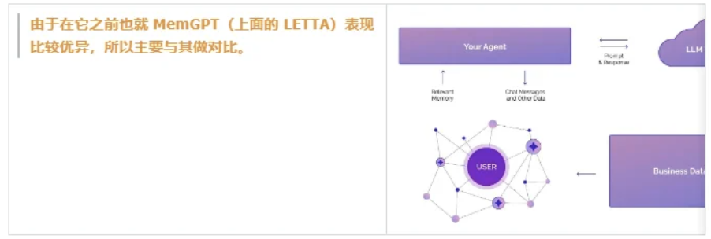

# Agent memory: fundamentals and application

## What is memory

The diagram summarizes four core capabilities:

- **Perception** — Enables the Agent to perceive the environment and accept multimodal information inputs.
- **Brain — decision making** — Enables the Agent to perform autonomous decision-making and planning to execute more complex tasks.
- **Brain — memory & knowledge** — Enables the Agent to have memory capabilities, storing internal knowledge and skills.
- **Action** — Enables the Agent to interact with the outside world, completing complex tasks through actions and perception.

> **Note:** This article focuses on the **Memory** component. Memory is vital to an Agent.

### Why Give Agents Memory?

- **Continuous learning** — The knowledge an Agent possesses is embedded within the LLM's parameters, which are static. Memory allows the Agent to accumulate knowledge and experience over time and optimize its capabilities.
- **Conversation continuity and behavioral consistency** — Memory enables the Agent to manage long-distance context. It can maintain consistent dialogue throughout long conversations, avoid establishing facts that contradict previous statements, and keep its actions consistent.
- **Personalized services and user experience** — With memory, an Agent can infer user preferences through interaction history and build a psychological model of the user, thereby providing personalized services and experiences that better align with those preferences.

### How to Define Memory?

The essence of **Large Language Models** is the simulation of human neural networks; therefore, **intelligent Agent memory** can also achieve stronger performance by **simulating how the human brain remembers**.

## Human Brain Memory Structure

Memory is the process by which humans **encode**, **store**, and **retrieve** information. To understand the structure of memory, we must clarify how memory is classified and what operations it provides.

### Memory Classification

Memory can be classified across different dimensions. Common classification methods include:

- **Classification by storage duration** — Memory is divided into **sensory memory**, **short-term memory**, and **long-term memory**:

  

  - **Sensory memory** — Stores information captured by the brain from the environment, such as sounds and visual information. Information in the sensory memory area can only be retained for a very short time.
  - **Short-term memory** — Stores information needed for processing during the thinking process; it is also known as **working memory**.
  - **Long-term memory** — Used for the long-term retention of human memories, such as knowledge and skills.

- **Classification by nature of content** — According to the nature of the content, memory can be divided into **declarative memory** and **non-declarative memory**. These are also known as **explicit memory** and **implicit memory**.

  

  **Main differences:**
  - **Verbal expression** — Declarative memory can be described using language (e.g., specific knowledge you have mastered). Non-declarative memory cannot be easily described with words (e.g., the physical skill of riding a bicycle).
  - **Conscious involvement** — **Explicit memory** requires conscious, active recall. **Implicit memory** involves unconscious participation and is often referred to as "muscle memory."

- **Classification by storage content** — Humans extract different types of content from memory. We can recall the past (**experiences**), master **knowledge** through memory, and preserve **skills** through memory.

  

  **Abstract memory categories:**
  - **Episodic memory** — Represents experiences; stores events that happened in the past.
  - **Semantic memory** — Represents knowledge; stores information and facts that are understood.
  - **Procedural memory** — Represents skills; stores the mastery of specific technical abilities.

## Intelligent Agent Memory

**Intelligent Agent** memory can be classified in the same way as human memory; however, due to differences in storage areas and formats, there are distinctions from human memory classification.

### Differences in storage areas

Storage areas within an intelligent agent mainly include:

- **Context** — Context is the Agent's short-term memory or working memory. The window is limited and information is easily forgotten.
- **LLM** — The LLM contains the majority of the Agent's knowledge and serves as the long-term memory area, encompassing different types of memory.
- **External storage** — Since the internal knowledge of an LLM cannot be updated in real time, memory is expanded through external storage. This part also belongs to the Agent's long-term memory.

> **Note:** Compared with human brain regions, **sensory memory** and **short-term memory** correspond to the Agent's **Context**, while **long-term memory** corresponds to the Agent's **LLM** and **external storage**.

### Differences in storage formats

Memory within an intelligent agent exists primarily in two forms: **parametric** and **non-parametric**. Both short-term and long-term memory areas can contain these formats.

Examples:

- **KV-cache** — Can be considered **parametric memory** in the short-term memory area.
- **LLM (model weights)** — **Parametric memory** in the long-term memory area.
- **External storage** — Exists as **non-parametric memory** in the long-term memory area.

### Classification of Agent Memory

Through the content above, we understand that there are certain differences between an Agent's storage areas and formats and the human brain, but they can still be mapped to one another, as illustrated below.

### Categorization by technical implementation

We can classify **Intelligent Agent** memory using the same dimensions but focusing on different content. Let's look at which technical implementations currently exist under different memory categories. *(Note: This is categorized by technical implementation rather than just memory type, as it does not affect the actual technical classification.)*

The following classification of current memory implementations is taken from the MemOS paper:

| Timescale | Consciousness | Mechanism | Example references |
| --- | --- | --- | --- |
| Short-term | Explicit | Prompt-based context | GPT-2, GPT-3, Prefix-Tuning, InstructGPT |
| Short-term | Implicit | Key–value cache mechanism | vLLM, StreamingLLM, H2O, KVQuant |
| Short-term | Implicit | Hidden state steering | Steer, ICV, ActAdd, StyleVec |
| Short-term | Implicit | Activation circuit modulation | SAC, DESTEIN, LM-STEER |
| Long-term | Explicit | Non-parametric retrieval-augmented generation | kNN-LMs, MEMWALKER, Graph RAG, LightRAG, HippoRAG |
| Long-term | Implicit | Parametric knowledge | BERT, RLHF, CTRL, SLayer |
| Long-term | Implicit | Modular parameter adaptation | LoRA, PRAG, DyPRAG, SERAC |
| Long-term | Implicit | Parametric memory editing | ROME, MEMIT, AlphaEdit |

### Key Takeaways

From the above classification, we observe that the technical implementations of Agent memory are highly detailed and varied:

- **Prompt engineering** — Optimization of **explicit memory** within the **short-term memory** region.
- **Knowledge base (RAG technology)** — Optimization of **explicit memory** within the **long-term memory** region.
- **Model fine-tuning** — Optimization of **implicit memory** within the **long-term memory** region.

## Agent Memory Implementations

The technical landscape of Agent Memory is rapidly evolving, with numerous open-source and commercial memory products appearing on the market. In 2025, a new wave of memory solutions debuted at an unprecedented pace. Notably, the Shanghai-based startup "Memory Expansion" (记忆张量) secured substantial angel-round funding and open-sourced their flagship memory product, MemOS.

Below, we review representative implementations of current memory products. The following information is based on available research papers, which may not reflect the very latest developments. For up-to-date progress, readers are encouraged to follow open-source releases.

### MemoryBank

- **Overview:**  
  MemoryBank published its foundational paper in 2023, establishing itself as an early pioneer in machine memory research. At that time, most AI applications were chat-based, so the research focus was on making chatbots more "human-like."

- **Reference Implementation:**  
  To demonstrate their approach, the researchers developed an AI companion chatbot called Silicon Friend (硅基朋友), integrating MemoryBank with psychological conversational data to strengthen emotional support and personalize services.

- **Performance:**  
  Silicon Friend excelled at memory recall, exhibited empathy, and accurately profiled user personalities. These capabilities demonstrated that MemoryBank could significantly improve long-term LLM interactions.

- **Key Features:**  
  - **Summarization and Recall:** Periodically summarizes conversations, stores summaries for efficient retrieval, and builds user profiles to generate personalized responses.
  - **Psychological Forgetting Mechanism:**  
    Employs a memory decay system inspired by Ebbinghaus's Forgetting Curve, simulating dynamic cognitive memory processes observed in humans.

**Diagram Breakdown: MemoryBank vs. SiliconFriend**

The system architecture depicted in the diagram consists of two main components:

- **MemoryBank (left):**  
  - Manages **Past Conversations**, **Event Summaries**, and **User Portraits**.  
  - Utilizes a **Memory Storage** system that tracks "**Memory Strength**" and simulates forgetting using the **Ebbinghaus Forgetting Curve**.

- **SiliconFriend (right):**  
  - Acts as the application interface.  
  - Combines the **Meta Prompt** (comprised of User Portrait and relevant memory) with the current conversation history to construct an **Augmented Prompt** for the LLM.

### LETTA

- **Overview:**  
  LETTA’s technology originates from **MemGPT** research and is currently an independent commercial product.

- **Design:**  
  The method draws on **virtual memory paging** from operating systems: applications can process datasets far larger than physical RAM by **paging** blocks between main memory and disk. LETTA applies that pattern to LLMs by splitting **context** into **main context** and **external context**; when main context space runs out, the system **exchanges** data with external storage.

- **Architecture (MemGPT / LETTA “context OS”):**  
  - **Inside the window:** **System instructions** (static MemGPT system prompt), **working context** (read/write via functions), and a **FIFO queue** (read/write via queue manager) feeding completion/output tokens.  
  - **Outside the window:** **Archival storage** and **recall storage**, coordinated by a **function executor** and **queue manager** that move information between long-term stores and the active prompt—analogous to RAM versus disk.

- **Key Components:**  
  LETTA’s architecture divides memory into **Main Context** and **External Context**, closely mirroring the distinction between RAM and Disk in operating systems.

  - **Main Context:**  
    Represents the portion of data that fits within the LLM’s prompt token window, and is further subdivided into:
    - **System Instructions:**  
      Contains static system prompts that define agent behavior.
    - **Working Context:**  
      Stores key facts, user preferences, and agent personality traits. In conversation scenarios, this section collects dynamically relevant user information.
    - **FIFO Queue:**  
      Maintains a rolling buffer of recent conversation records. This includes both the latest conversation logs and compressed summaries of interactions that have cycled out of the window.

- **Memory Operations:**  
  - **Recursive Summarization:**  
    When older conversation records must be removed from the FIFO queue, a new summary is generated based on the previous recursive summary and the messages being evicted. This process compresses information, conserving limited context space.
  - **Memory Update and Retrieval:**  
    Typically handled by the function executor, which updates memory based on user activity and retrieves relevant information as needed.

### ZEP

- **Overview:**  
  ZEP is engineered to address enterprise requirements by extending beyond static, document-based RAG (Retrieval-Augmented Generation) approaches. It enables retrieval of real-time information sourced from both ongoing conversations and dynamic business data streams.

- **Design:**  
  The centerpiece of ZEP’s architecture is its proprietary **Graphiti engine**, which implements a **time-aware knowledge graph**. This facilitates advanced temporal reasoning and contextual retrieval, supporting enterprise-scale memory management.

- **Architecture:**  
  - **Your Agent** exchanges **prompt & response** with the **LLM**.  
  - **USER** graph memory: the agent writes **chat messages and other data** into the user network and reads **relevant memory** back for retrieval-augmented turns.  
  - **Business data** can feed into the user memory layer alongside conversational signals.  
  - *(MemGPT / LETTA above is the usual baseline for comparison because it already performed strongly before ZEP.)*

- **Performance Comparison:**  
  ZEP delivers superior performance in industry benchmarks relative to MemGPT (now LETTA):
  - **DMR Benchmark:**  
    Achieves a 94.8% score, outperforming MemGPT’s 93.4%.
  - **LongMemEval Benchmark:**  
    Demonstrates an 18.5% increase in accuracy, particularly in complex, temporally nuanced enterprise tasks.

- **Knowledge Graph Structure:**  
  ZEP organizes its memory architecture into three hierarchical graph levels, each representing a different abstraction:

  - **Episodic Graph (Raw memory storage):**  
    - **Description:** Serves as lossless storage for raw input data—such as chat messages, user questions, or JSON records.
    - **Structure:** Nodes correspond to distinct interaction "episodes," and edges link these episodes to the underlying semantic entities they involve.

  - **Semantic Graph (Knowledge extraction):**  
    - **Description:** Built atop the episodic layer, this level extracts and organizes semantic entities and their interrelations.
    - **Structure:** Nodes represent semantic entities, while edges encode the relationships identified among them.

  - **Community Subgraph (High-level memory clustering):**  
    - **Description:** Provides an abstracted, global view by clustering tightly-connected semantic entities into “communities” that summarize their shared characteristics or topics.
    - **Structure:** Nodes correspond to these communities, while edges connect communities to their constituent semantic entity members.
    - **Inspiration:** This approach is based on the design principles of GraphRAG, enhancing global comprehension and retrieval in conversational semantic memory.

- **Scientific Foundation:**  
  The architecture is grounded in cognitive science, adopting a dual-store memory model that distinguishes between raw episodic records and derived semantic knowledge—mirroring the human brain’s memory hierarchy.