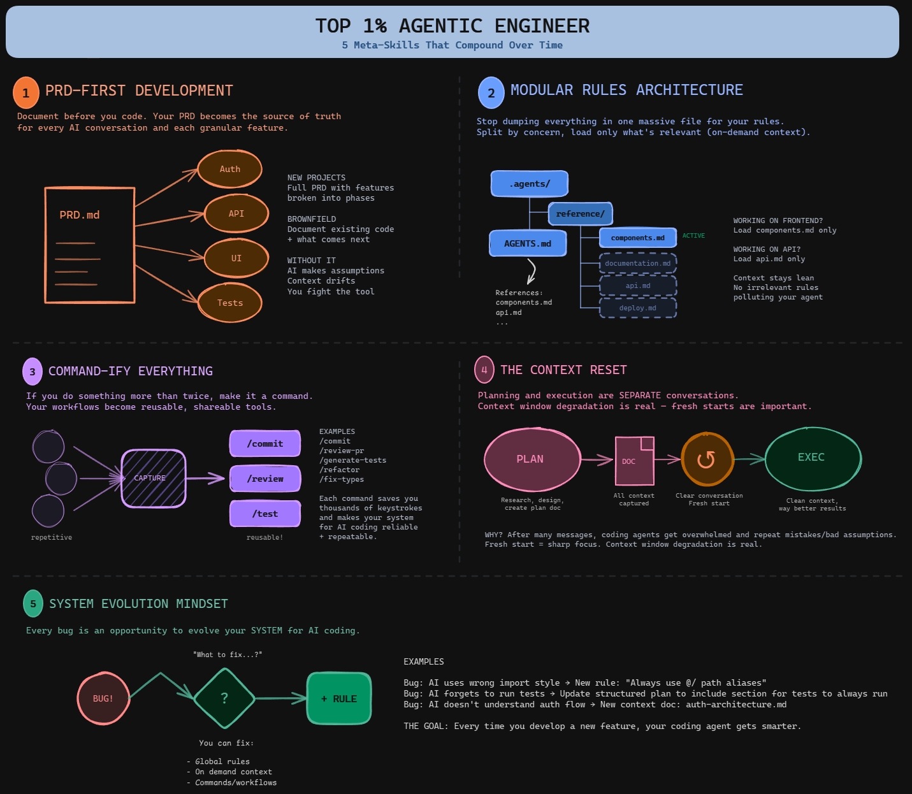
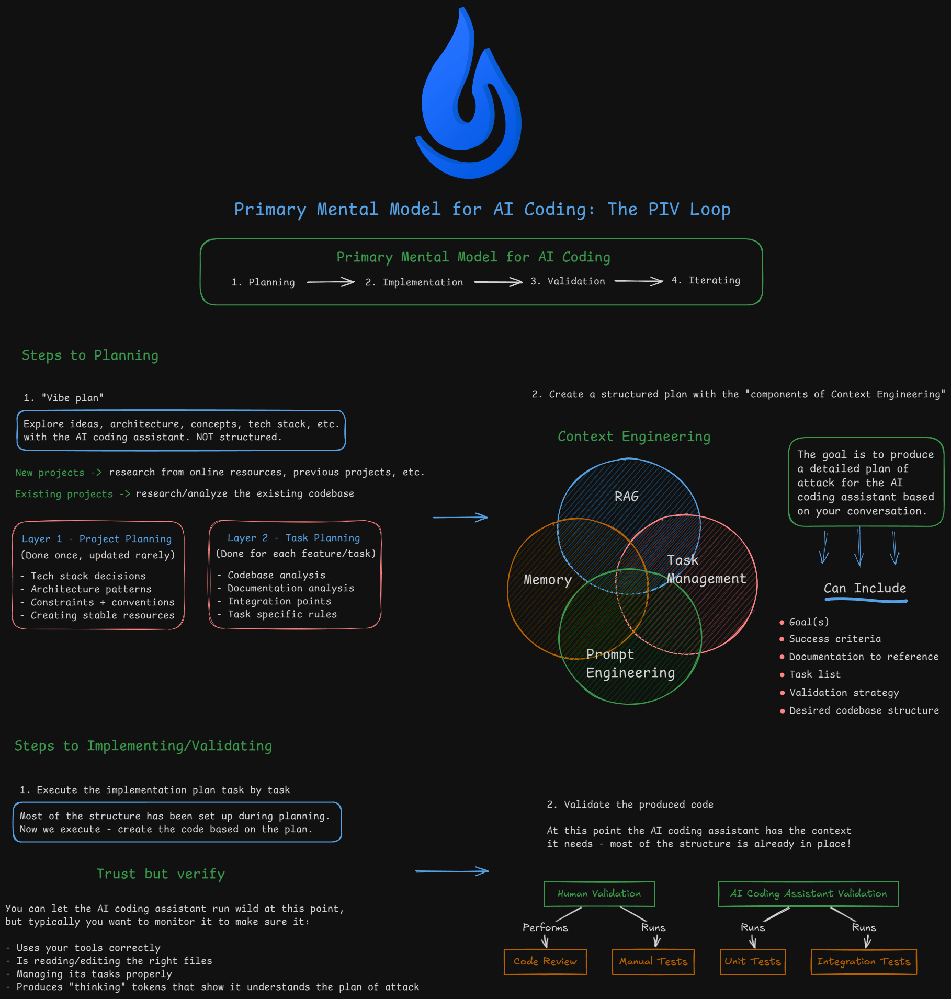

# Top techniques for agentic engineers 

- Break down each skill: 
	- starting every project with a PRD, 
	- keeping your rules modular and focused, 
	- turning repetitive workflows into commands, 
	- resetting context between planning and execution, and 
	- treating every bug as an opportunity for system evolution. 

- These are the skills that compound over time and make you genuinely dangerous with AI coding tools.


## PRD-first Development

- Document before you code.
- **PRD.md** is the north star for the coding agent and everything you plan to build. 
- Your PRD `PRD.md` becomes the source of truth for every AI conversation and help split up each granular feature
	- Auth, API, UI, Tests
	- 
- **BROWNFIELD** : document existing code + what comes next
- In claude, it is like a command `/create-prd`. `/create-prd` uses a template that defines followings
	- mission, features, target-user, scope, out-of-scope, etc.
	- code architecture layout
	- key design patterns
- `/core_piv_loop:prime` command, load all necessary context in from the project
	- Agent starts to find/read context files,  sort of `prime` itself of the codebase
	- Read `README.md`, `.claude\PRD.md`, source codes, .toml, .json files
	- PRD is one of the core files
- Then ask **"Based on the PRD what should we build next?"**

## Modular Rules Architecture

- Avoid making global rules too long to overwhelm the LLM with number of rules
	- large files like `AGENTS.md`, `CLAUDE.md`, what ever global rule file 
	- use reference to instruct LLM to read documents when working on specific areas
	- **Using reference in global rules** is very powerful way to keep your rules concise while still has all the contexts you need
- Split by concern, work on specific component so context stays lean No irrelevant rules polluting your agent
	- Frontend , load `components.md` only
	- API , load `api.md` only


## Command-ify everything

- If you do something more than twice, make it a command. You workflows become reusable, shareable tools.
- These are just markdown documents that load as context to define a process for coding agent
- Each command saves thousands of keystrokes and makes the system for AI coding reliable + repeatable
- Examples: `/commit`, `review-pr`, `generate-tests`, `refactor`, `fix-types`
- Plan & Excucation
```bash
/core_piv_loop:prime	Load project context and codebase understanding
/core_piv_loop:plan-feature	Create comprehensive implementation plan with codebase analysis
/core_piv_loop:execute	Execute an implementation plan step-by-step
```
- Validataion 
```bash
/validation:validate	Run full validation: tests, linting, coverage, frontend build
/validation:code-review	Technical code review on changed files
/validation:code-review-fix	Fix issues found in code review
/validation:execution-report	Generate report after implementing a feature
/validation:system-review	Analyze implementation vs plan for process improvements
```
- Bug Fixing
```bash
/github_bug_fix:rca	Create root cause analysis document for a GitHub issue
/github_bug_fix:implement-fix	Implement fix based on RCA document
```
- Misc
```bash
/commit	Create atomic commit with appropriate tag (feat, fix, docs, etc.)
/init-project	Install dependencies, start backend and frontend servers
/create-prd	Generate Product Requirements Document from conversation
```


## The context reset

- Plan and execution are separate conversations
- Context window degration is real - fresh starts are important
- Reason: after many messages, coding agents get overwhelmed and repeat mistakes/bad assumptions. Fresh start = sharp focus
- Context window degradation is real

## System Evolution mindset

- Every bug is an opportunity to evolve your system for AI coding
- You can fix
	- global rules
	- on demand context
	- commands/workflows
- Examples:
	- AI uses wrong import style --> New rule: "Always use @/ path aliases"
	- AI forgets to run tests --> Update structured plan to include section for tests to always run 
	- AI doesn't understand auth flow --> New context doc: auth-architecture.md

## References
- [Project Example: habit-tracker](https://github.com/coleam00/habit-tracker/tree/main)
