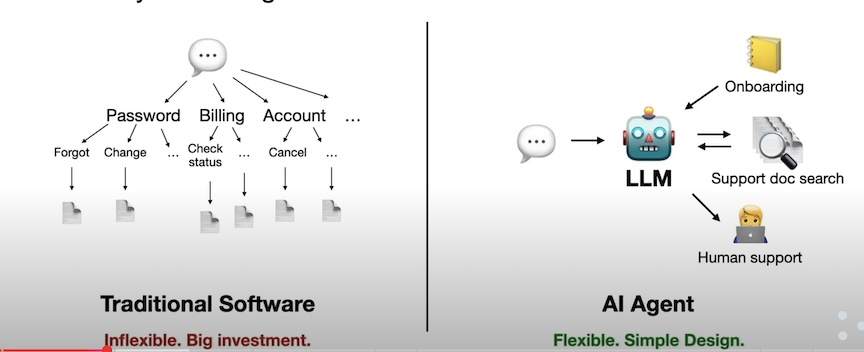
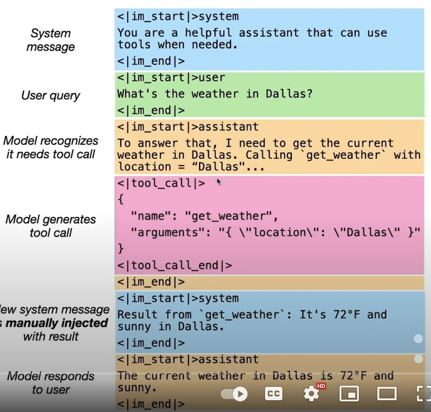
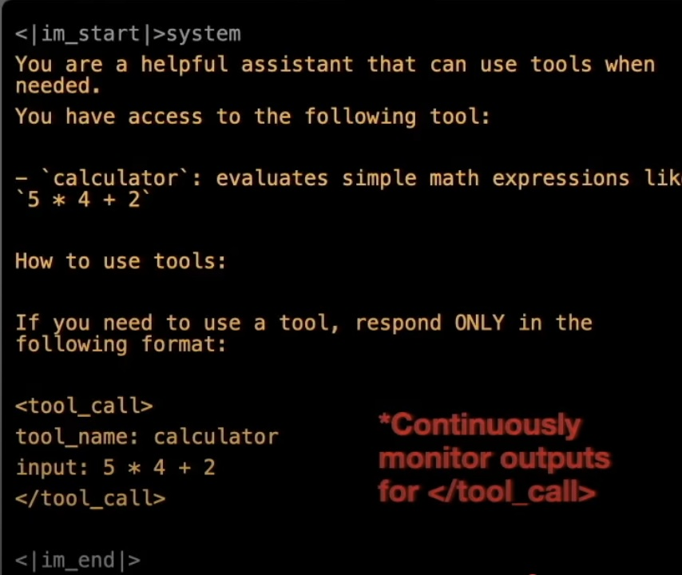
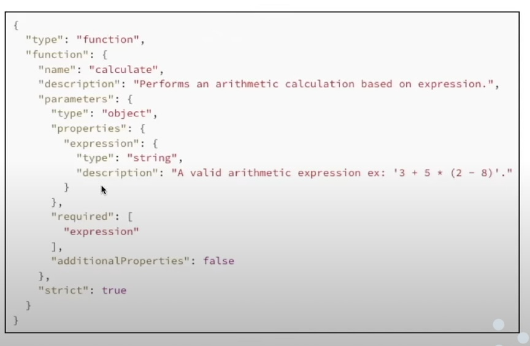

## Improving LLM with Tools (example through OpenAI's Agents SDK) 

### AI Agents: new way of thinking about software 
- A new way of thinking about software 
- Traditional software 
    - Inflexible, Big investiment
    - long tail issues
- AI Agents 
    - Flexible, simple design



### How does Tool-use work?

- Wrapping LLMs with some code
    - Monitor LLM output for tool calls
    - Pause generation and execute the tool call(with code)
    - Capture the response and pass it back to model



- How does LLMs know how to do tool calls?
    -  Prompting model 
        - Simply describe the tools 
    - Continuously monitor the LLM output for tool calls 
        - </tool call>
 
    - Use fine-tuned model via API
        - use json like input template
        - API stop inference for the tool call
        - Fine tuning: requires significant data to train the model than prompting





### Example of using OpenAI's Agents SDK

- Import and Give instructions and Define tool
- OpenAI define **Agents** as `Agents are the core building block in your apps. An agent is a large language model(LLM) configured with instructions and tools.`  
- `@function_tool` decorator
- **Create Agent**
```python
agent = Agent(
    name="YouTube Transcript Agent",
    instructions=instructions,
    tools=[fetch_youtube_transcript],
)
```


```python
# imports
from youtube_transcript_api import YouTubeTranscriptApi
import re
from agents import Agent, function_tool, Runner, ItemHelpers, RunContextWrapper
from openai.types.responses import ResponseTextDeltaEvent
from dotenv import load_dotenv
import asyncio

# import environment variables from .env file
load_dotenv()

# define instructions
instructions = "You provide help with tasks related to YouTube videos."
# define tool
@function_tool
def fetch_youtube_transcript(url: str) -> str:
    """
    Extract transcript with timestamps from a YouTube video URL and format it for LLM consumption
    
    Args:
        url (str): YouTube video URL
        
    Returns:
        str: Formatted transcript with timestamps, where each entry is on a new line
             in the format: "[MM:SS] Text"
    """
    # Extract video ID from URL
    video_id_pattern = r'(?:v=|\/)([0-9A-Za-z_-]{11}).*'
    video_id_match = re.search(video_id_pattern, url)
    
    if not video_id_match:
        raise ValueError("Invalid YouTube URL")
    
    video_id = video_id_match.group(1)
    
    try:
        transcript = YouTubeTranscriptApi.get_transcript(video_id)
        
        # Format each entry with timestamp and text
        formatted_entries = []
        for entry in transcript:
            # Convert seconds to MM:SS format
            minutes = int(entry['start'] // 60)
            seconds = int(entry['start'] % 60)
            timestamp = f"[{minutes:02d}:{seconds:02d}]"
            
            formatted_entry = f"{timestamp} {entry['text']}"
            formatted_entries.append(formatted_entry)
        
        # Join all entries with newlines
        return "\n".join(formatted_entries)
    
    except Exception as e:
        raise Exception(f"Error fetching transcript: {str(e)}")
``` 

### What's next

- Balancing predictability and capability


## References
[1] How to Improve LLMs with Tools: https://www.youtube.com/watch?v=-BUs1CPHKfU  
[2] github code example: https://github.com/ShawhinT/YouTube-Blog/tree/main/agents/1-tool_use  

