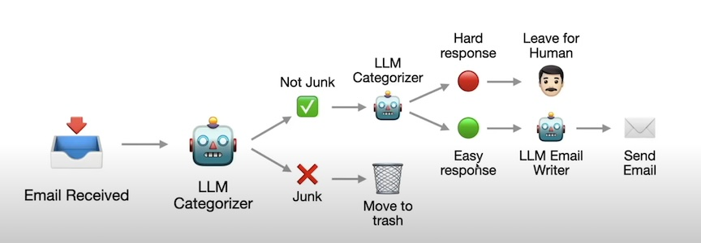
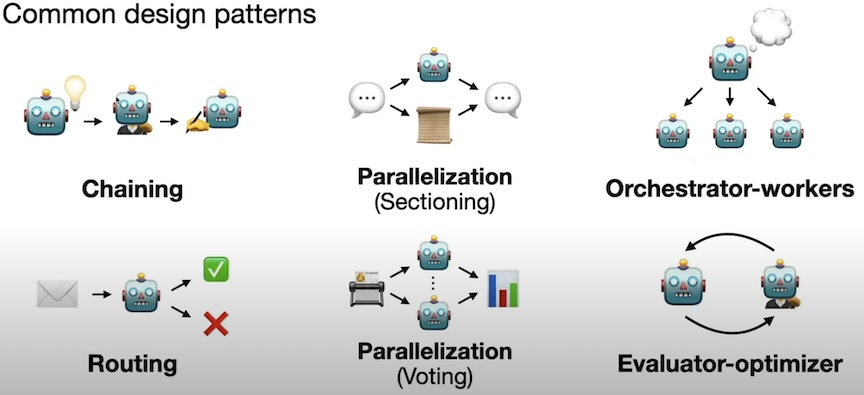
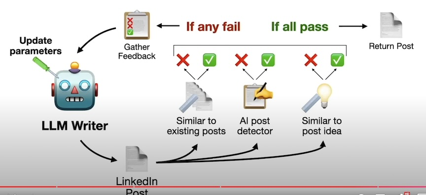

# AI Agent 
- AI agent is basically a computer program that can act on its own to achieve a specific goal. 
- OpenAI: 
    - A LLM configured with instructions and `tools`
- Hugging Face: 
    - system where LLM can execute more complex tasks through `planning` and using tools
- Anthropic:
    - Systems where LLMs dynamically direct their own processes and tool usage, maintaining control over how they accomplish tasks.

## 3 Key features

- LLM plays a central role
- Tools are used to automate tasks (web search, python interpreter, email, access another specialized LLM etc.)
- Autonomy - `plan, reason, reflect` 

## Why agents are important

- LLM aren't enough to solve (most) real-world problems
    - Agents need to interact with reality whereas LLM lives in imaginationland 
    - Tools can be used to automate tasks whereas LLMs are limited to generating text
- Test-time compute (i.e. Reasoning) 

## 3 levels of Agents

- **LLM + Tools**: 
    - LLM is only snapshot of a pre-trained model (data) 
    - Web search (access latest info), code interpreter (doing math, etc.) 
    - API calls (e.g. Youtube, Gamil, Notion)
    - Computer Use (GUI like mouse, keyboard, etc.) 
    - Another external model (e.g. image generation) 
    - RAG (internal knowledge base, knowledge graph, etc.)
    - Memory (conversation, chat history, etc.)

- **LLM Workflow**: 
    - Pre-defined sequence of steps with at least one LLM 
    - No longer limited to a single LLM, can have multiple LLM systems to solve more complex tasks 
    - common design patterns
        - chaining
        - routing
        - parallelization (e.g. sectioning, votin)
        - orchestratrator-worker
        - evaluator-optimizer (LLMs generating resp and LLM evaluating resp)
- **LLM in a loop**: 
    - Giving LLM real-world feedback on responses (until satisfactory) 
    - End-to-End reinforcement learning on real-world feedback (RL)

|Agent LLM workflow example|Agent LLM workflow common patterns|
|:-:|:-:|
|||

 

## Perceives its environment: 

- AI agents can gather information about what's happening around them. 
- This could be through sensors (like a physical robot) or by collecting data (like on a website).

## Makes decisions: 

- They use the information they've collected to figure out what to do next. 
- This might involve following rules or using more complex AI techniques like machine learning.

## Takes action: 

- AI agents can then carry out their decisions. 
- For instance, an AI agent on a website might recommend products to you based on your browsing history.

## AI agents are used in a lot of different places 
- from chatbots and 
- virtual assistants to 
- self-driving cars.  

They're basically a way to automate tasks and make computers more helpful.	

## References:
[1] An Introduction to AI Agents (for 2025): https://www.youtube.com/watch?v=ZaY5_ScmiFE   

