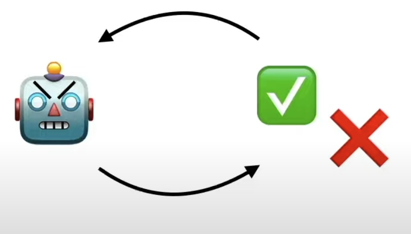
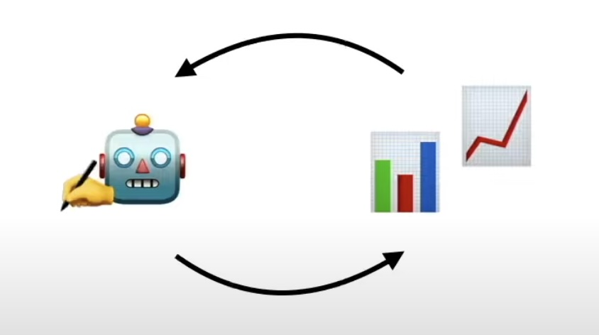

## LLM in a Loop: Automate feedback with evals

- how to improve LLM systems with automated feedback loops 

### Refining LLM Responses

- The power of trial and error 
- The importance of feedback loops 
    - Example: Ask ChatGPT to rewrite my Resume 
    - Feedback 1: `Can you use stronger action words for each bullet point?`
    - Feedback 2: `Please compress to one page. Limit bullets to 2-3 max.`
    - Feedback 3: `Can you format this to markdown?`
    - Final version of Resume 
- Iterative process 

### Automating Feedback Loops

- Automatically providing feedback to an LLM to improve outputs
- Examples: 
    - Coding Agent , generate code and then pass unit test to get feedback 
    - Argument Writer,
    - Video Idea generator, 
    - Twitter Agent,
- Without human in the loop, allow LLM to get feedback

### 3 Types of (automated) evals

- Type 1: Rule-based:
    - Tests and metrics that can be built with simple code
    - binary rules: Error raised, Proper format?(linter), Contains, Correct answer
    - Continous rules: Length, Faithfulness, NLP ROUGE BLEU, Readability score, etc. 
    - Limitations: Some tests cannot be built with code
    
- Type 2: LLM-based
    - Flexible assessments with `Judge LLMs`
    - Guidance on how to improve
    - Challenge: Aligning LLM with desired result

- Type 3: Real-world Data
    - Giving LLM real-world feedback
    - CTR 
    - Conversions
    - User Satisfaction
    - Limitations: Data integration may not be available

- Key task: Picking evals that correlate with desired outcome

### Example: Refining Upwork Profile(in a loop)

- Imports
```python 
from openai import OpenAI
from dotenv import load_dotenv
import os

from functions import *
# import sk from .env file
load_dotenv()

# connect to openai API
client = OpenAI(api_key=os.getenv("OPENAI_API_KEY"))
```
- Instructions(Developer Message) 
    - both instructions and examples are in `/context/` folder and are markdown format
```python
# read existing profile text
instructions = read_context("instructions.txt")
# read examples
example = read_context("example.txt")

# define instructions 
instructions = f"""{instructions}

---

## Here's an example"
{example}

----

## Important Guidelines:
- Profiles should be written in **PLAIN TEXT** (NOT markdown)

----
"""
```

- Initial Prompt
```python 
# read current profile
background = read_context("background.txt")
# define customer
customer = "Founders and CXOs of small to medium sized business, seeking guidance with AI use cases"
prompt = f"""### 📄 Upwork Profile Rewrite Task

Below is a freelancer's background, your task is to rewrite it based on high-converting Upwork profile best practices. Their ideal customer avatar is: {customer}.

----

{background}

----
"""
```
- Defining Evals
    - `word_count_eval()` : checks if word count is between 300 - 800
    - `client_focus_eval()` : counts the occurrences of "you" and "your", 5 or more is passing
    - `social_proof_eval()` : checks text for "$" or client quotes using regex
    - `readability_eval()` : evaluates the Flesch-Kincaid grade level, 12th grade or less is passing

- LLM in a Loop
    - run the following loop to get feedback from LLM 
    - 1. rewrite profile
    - 2. evaluate new profile
    - 3. craft new prompt with feedback
    - 4. check if all tests passed
    - 5. if not, repeat from step 1
    - 6. if all tests passed, stop loop 
    - intermediate results are stored in `/profiles` folder
```python 
all_passed = False
counter = 0
max_iter = 5

while not all_passed and counter < max_iter:
    
    # rewrite profile
    new_profile = rewrite_profile(instructions, prompt, client)
    write_profile(new_profile, f"profile-{counter}.txt")

    # evaluate new profile
    results = run_all_evals(new_profile)
    print(results)

    # craft new prompt with feedback
    prompt = generate_eval_report(new_profile)

    # check if all tests passed
    all_passed = all(results.values())

    # udpate counter
    counter += 1

# Following is the output of eval loop
{'word_count': True, 'client_focus': True, 'social_proof': True, 'readability': False}
{'word_count': False, 'client_focus': True, 'social_proof': True, 'readability': False}
{'word_count': True, 'client_focus': True, 'social_proof': True, 'readability': False}
{'word_count': True, 'client_focus': True, 'social_proof': True, 'readability': False}
{'word_count': True, 'client_focus': True, 'social_proof': True, 'readability': True}
```

### Limitations 

- Reward hacking(at test-time): Maximizes positive feedback without improving results
- Example: Twitter Agent, tweets become more emngaging based feedback of counters but also more toxic! 
- Key point: Be careful what you optimize for 

  
  

## References
[1] LLM in a loop: https://www.youtube.com/watch?v=6VcXukJuGA0  
[2] github: https://github.com/ShawhinT/YouTube-Blog/tree/main/agents/3-llm-loop  
