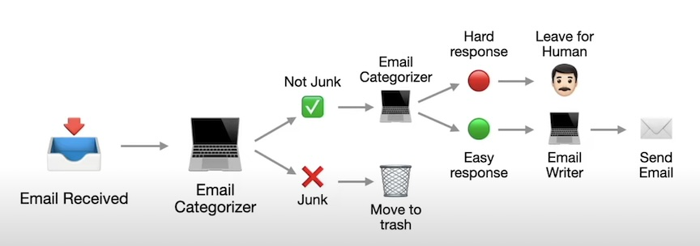
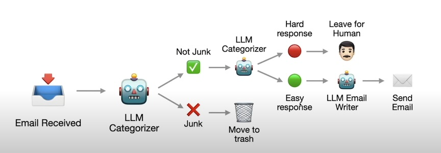
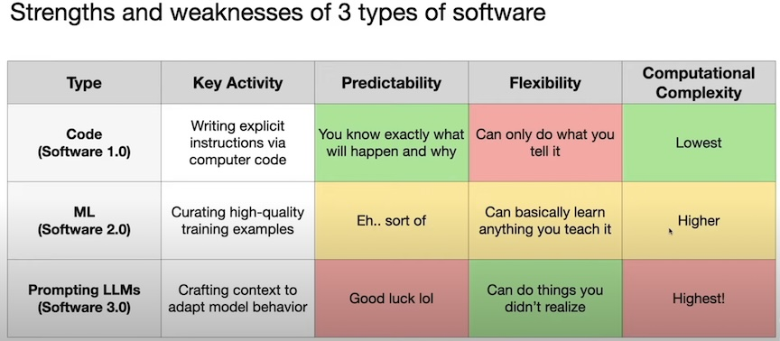

## LLM Workflows : From Automation to AI Agents

### What is Workflows?

- A Set of steps that generate a desired result
- However, building workflows with rule-based code is hard and limited 
- A way to build more powerful automations is to use LLMs to build workflows
    - Plugin LLMs to replace rule-based code 
    - `Agentic workflow` = workflow with some level of agency
    - `AI agent` = workflow with full agency




### Design patterns for building workflows

- chaining 
- Routing
- Parallelization
- Orchestrator-workers
- Evaluator-optimizer 

### LLMs Aren't a Cure-All 

- Strengths and weaknesses of 3 types of software


### Example: Artificial Virtual Assistants(AVA) 

- System design

")

####  Create agents
- Imports 
```python
# imports
from tools.functions import *
from tools.for_agents import *

from agents import Agent, Runner, ModelSettings
from dotenv import load_dotenv

```
- Instructions
```python
planner_instructions = read_instructions("ava.md") + read_instructions("planner.md")
```

- Forcing Structure Outputs
```python 
from pydantic import BaseModel
class PlannerOutput(BaseModel):
    exec_required: bool
    exec_inst: str
    user_notes: str
    exec_notes: str
```
- Create Planner Agent
    - `read_dir_struct` and `read_file_contents` are tools that can be used by the planner agent.  `/tools/for_agents.py` 

```python 
# Create planner agent
planner_agent = Agent(
    name="Planner Agent",
    instructions=planner_instructions,
    tools=[read_dir_struct, read_file_contents],
    model_settings=ModelSettings(temperature=0.5),
    output_type=PlannerOutput,
)

# Executor Agent
executor_instructions = read_instructions("ava.md") + read_instructions("executor.md")
executor_agent = Agent(
    name="Executor Agent",
    instructions=executor_instructions,
    tools=[read_dir_struct, read_file_contents, write_email_draft, overwrite_existing_file],
    model_settings=ModelSettings(temperature=0),
)
```
- Running Workflow
    - Pass User Request to Planner 
    - Process Request
    - if exec_required, run Executor
```python 
from agents import Runner

async def main():
    # read request from request.txt
    with open("request.txt", "r") as file:
        request = file.read()

    # run planner agent
    result = Runner.run_streamed(
        planner_agent, 
        request,
    )
    # handle stream events
    print("--- Analyzing ---")
    await handle_stream_events(result)

    # print planner agent's output
    print()
    print("--- Planner Agent Output ---")
    print(result.final_output.user_note)
    print()

     # check if execution is required
    if result.final_output.exec_required:
        result = Runner.run_streamed(
            executor_agent,
            result.final_output.exec_inst
        )
    
        print("--- Executing ---")
        await handle_stream_events(result)

        print()
        print("--- Executor Agent Output ---")
        print(result.final_output)
        print()

if __name__ == "__main__":
    asyncio.run(main())

```

## References
[1] LLM Workflows: From Automation to AI Agents (with Python): https://www.youtube.com/watch?v=Nm_mmRTpWLg  
[2] github code: https://github.com/ShawhinT/YouTube-Blog/tree/main/agents/2-agentic-workflows  
