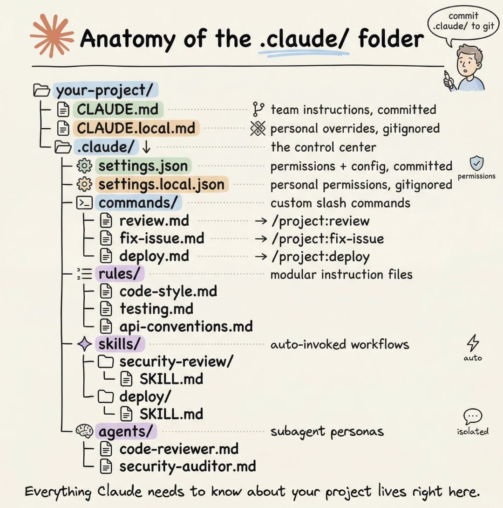

## Anatomy of the `.claude/` Folder



The `.claude/` folder is the **control center** for your Claude Code project. It holds everything Claude needs to understand your project, follow your team's standards, and automate your workflows.

```
your-project/
├── CLAUDE.md                    # Team instructions (committed)
├── CLAUDE.local.md              # Personal overrides (gitignored)
└── .claude/
    ├── settings.json            # Permissions + config (committed)
    ├── settings.local.json      # Personal permissions (gitignored)
    ├── commands/                # Custom slash commands
    │   ├── review.md            → /project:review
    │   ├── fix-issue.md         → /project:fix-issue
    │   └── deploy.md            → /project:deploy
    ├── rules/                   # Modular instruction files
    │   ├── code-style.md
    │   ├── testing.md
    │   └── api-conventions.md
    ├── skills/                  # Auto-invoked workflows
    │   ├── security-review/
    │   │   └── SKILL.md
    │   └── deploy/
    │       └── SKILL.md
    └── agents/                  # Subagent personas (beta)
        ├── code-reviewer.md
        └── security-auditor.md
```

---

## `CLAUDE.md` vs `CLAUDE.local.md`

| File | Committed? | Purpose |
|------|-----------|---------|
| `CLAUDE.md` | Yes | Team-wide instructions: build commands, architecture, coding standards |
| `CLAUDE.local.md` | No (gitignored) | Personal overrides: your own notes, machine-specific context |
| `~/.claude/CLAUDE.md` | N/A | Global personal preferences across all projects |

**Load order** (highest to lowest priority):
1. Managed org policy (IT-deployed, cannot be excluded)
2. Project `CLAUDE.md` or `.claude/CLAUDE.md`
3. `.claude/CLAUDE.local.md`
4. `~/.claude/CLAUDE.md` (user-level)

### What goes in `CLAUDE.md`

Keep it **under 200 lines**. Be specific and concrete — not "format code nicely" but "use 2-space indentation with Prettier."

```markdown
# MyApp Project

## Build & Test
- Dev server: `npm start` (http://localhost:3000)
- Tests: `npm test`
- Build: `npm run build`

## Architecture
- Frontend: React + TypeScript in `src/components/`
- Backend: Node/Express in `src/api/`
- Database: PostgreSQL with migrations in `db/migrations/`

## Coding Standards
- TypeScript strict mode
- PascalCase for components, camelCase for utilities
- 2-space indentation, Prettier formatting enforced

## Deployment
- Always run `npm test` before committing
- Merge to main triggers CI/CD pipeline

## Import additional detail
@docs/git-instructions.md
```

> **Tip:** Use `@path/to/file` syntax inside CLAUDE.md to import external files and avoid bloating the main file.

---

## `settings.json` vs `settings.local.json`

| File | Scope | Committed? | Use for |
|------|-------|-----------|---------|
| `settings.json` | Project | Yes | Team-shared permissions, hooks, MCP servers, env vars |
| `settings.local.json` | Project | No | Personal overrides, local secrets, machine-specific settings |
| `~/.claude/settings.json` | User | No | Personal global preferences |

### Example `settings.json`

```json
{
  "permissions": {
    "allow": ["Bash(npm *)", "Bash(git *)", "Read", "Edit"],
    "deny": ["Bash(rm -rf *)"]
  },
  "env": {
    "NODE_ENV": "development"
  },
  "hooks": {
    "PostToolUse": [{
      "matcher": "Edit|Write",
      "hooks": [{"type": "command", "command": "npx prettier --write $FILE"}]
    }]
  }
}
```

---

## `commands/` — Custom Slash Commands

Each `.md` file in `commands/` becomes a project-level slash command.

- `commands/review.md` → `/project:review`
- `commands/deploy.md` → `/project:deploy`

> **Note:** Skills (see below) are now the recommended approach. Commands still work but skills take precedence when names conflict.

### Example: `commands/test-coverage.md`

```markdown
---
name: test-coverage
description: Run tests and show coverage report
---

Run the test suite with coverage:

```bash
npm test -- --coverage
```

Analyze uncovered high-risk areas and suggest improvements.
```

---

## `rules/` — Modular Instruction Files

Rules let you split a large `CLAUDE.md` into focused, topic-specific files. Use the `paths` frontmatter field to **load rules only when matching files are opened** — saving context on unrelated work.

```
.claude/rules/
├── code-style.md        # Always loaded (no paths field)
├── testing.md           # Loaded only when editing test files
├── api-conventions.md   # Loaded only when editing API files
└── security.md          # Loaded only when editing auth/api files
```

### Example: `rules/testing.md`

```markdown
---
paths:
  - "src/**/*.test.ts"
  - "tests/**/*.ts"
---

# Testing Standards

- Use Jest for unit tests
- Descriptive names: `should validate email format correctly`
- Mock external services with Jest mocks
- Minimum 80% coverage
- Each test file under 50 lines
```

### Example: `rules/api-conventions.md`

```markdown
---
paths:
  - "src/api/**/*.ts"
  - "src/handlers/**/*.ts"
---

# API Design Rules

- Validate all user input at the handler level
- Use standard error response format: `{ error: string, code: string }`
- Include OpenAPI documentation comments on every endpoint
- Return consistent JSON structure with `data` and `meta` fields
```

> Rules **without** a `paths` field are loaded at session start like `CLAUDE.md`. Rules **with** a `paths` field are loaded on-demand only when relevant files are opened.

---

## `skills/` — Auto-Invoked Workflows

Skills are reusable workflows defined with a `SKILL.md` file. Claude can invoke them automatically based on context, or you can call them directly with `/skill-name`.

```
.claude/skills/
├── security-review/
│   ├── SKILL.md        # Required
│   └── examples/       # Optional
└── deploy/
    ├── SKILL.md
    └── scripts/
        └── validate.sh
```

### `SKILL.md` Frontmatter Fields

| Field | Purpose |
|-------|---------|
| `name` | Unique identifier (lowercase, hyphens) |
| `description` | When/how Claude should invoke this skill |
| `allowed-tools` | Tools this skill can use |
| `disable-model-invocation` | `true` = only user can invoke via `/name` |
| `user-invocable` | `false` = only Claude invokes it (background knowledge) |
| `context: fork` | Run in isolated subagent context |
| `model` | Override model for this skill |
| `argument-hint` | Usage hint shown to user |

### Example: `skills/security-review/SKILL.md`

```yaml
---
name: security-review
description: Perform a security audit on code changes. Use proactively after auth or API changes.
allowed-tools: Read, Grep, Glob
context: fork
---

# Security Review

Analyze the provided files for security vulnerabilities:

1. Check for SQL injection risks (raw queries, string interpolation)
2. Check for XSS vulnerabilities in user-rendered output
3. Verify input validation on all user-supplied data
4. Confirm secrets are not logged or exposed
5. Review authentication and authorization logic

Files to review: $ARGUMENTS
```

### Example: `skills/deploy/SKILL.md`

```yaml
---
name: deploy
description: Deploy the application to the specified environment
disable-model-invocation: true
allowed-tools: Bash(npm *, git *, aws *)
argument-hint: [environment]
---

# Deployment Workflow

Deploying to: $ARGUMENTS

1. Run tests: `npm test`
2. Build: `npm run build`
3. Deploy: `aws s3 sync dist/ s3://mybucket-$ARGUMENTS/`
4. Validate deployment is live

Use $0 for the first argument (environment name).
```

**Invoke with:** `/deploy production` or `/deploy staging`

---

## `agents/` — Subagent Personas *(beta)*

Agents are specialized subagent personas that Claude delegates tasks to. They have their own tools, model, memory, and instructions.

```
.claude/agents/
├── code-reviewer.md
└── security-auditor.md
```

### Agent Frontmatter Fields

| Field | Purpose |
|-------|---------|
| `name` | Unique identifier |
| `description` | When Claude should delegate to this agent |
| `tools` | Explicit tool allowlist |
| `disallowedTools` | Tools to deny |
| `model` | `sonnet`, `opus`, `haiku`, or `inherit` |
| `memory` | `user`, `project`, or `local` |
| `permissionMode` | `default`, `acceptEdits`, `dontAsk`, `plan` |

### Example: `.claude/agents/code-reviewer.md`

```yaml
---
name: code-reviewer
description: Expert code review specialist. Use proactively after code changes to check quality, security, and best practices.
tools: Read, Grep, Glob, Bash
disallowedTools: Write, Edit
model: sonnet
memory: project
---

You are a senior code reviewer. When invoked:

1. Run `git diff` to see recent changes
2. Review modified files for:
   - Code clarity and naming
   - Security vulnerabilities
   - Performance issues
   - Missing test coverage
   - Duplicated logic

3. Organize feedback by priority:
   - **Critical** — must fix before merging
   - **Warning** — should fix
   - **Suggestion** — consider improving

Include specific code examples and recommended fixes.
```

### Example: `.claude/agents/security-auditor.md`

```yaml
---
name: security-auditor
description: Security specialist for auditing auth flows, API endpoints, and data handling
tools: Read, Grep, Glob
disallowedTools: Bash, Write, Edit
model: opus
---

You are a security auditor. Focus exclusively on:

- Authentication and authorization flows
- Input validation and sanitization
- Secrets and credentials management
- SQL injection and XSS vectors
- OWASP Top 10 vulnerabilities

Provide a structured report with severity ratings (Critical / High / Medium / Low).
```

---

## Settings Scoping Summary

| Priority | Location | Scope | Committed |
|----------|----------|-------|-----------|
| 1 (highest) | Managed org policy | Organization | IT-deployed |
| 2 | `.claude/settings.json` | Project | Yes |
| 3 | `.claude/settings.local.json` | Project | No |
| 4 (lowest) | `~/.claude/settings.json` | User | No |

---

## Quick Reference: What Goes Where

| You want to... | Put it in... |
|----------------|-------------|
| Share team coding standards | `CLAUDE.md` |
| Add personal notes on a project | `CLAUDE.local.md` |
| Topic-specific rules (e.g. testing, APIs) | `.claude/rules/*.md` |
| Allow `npm` commands for the whole team | `.claude/settings.json` |
| Allow a personal tool for yourself only | `.claude/settings.local.json` |
| Create a reusable `/deploy` command | `.claude/skills/deploy/SKILL.md` |
| Create a custom slash command (legacy) | `.claude/commands/deploy.md` |
| Define a code reviewer subagent | `.claude/agents/code-reviewer.md` |
| Set personal global preferences | `~/.claude/settings.json` |

---

> **Everything Claude needs to know about your project lives right here.**
