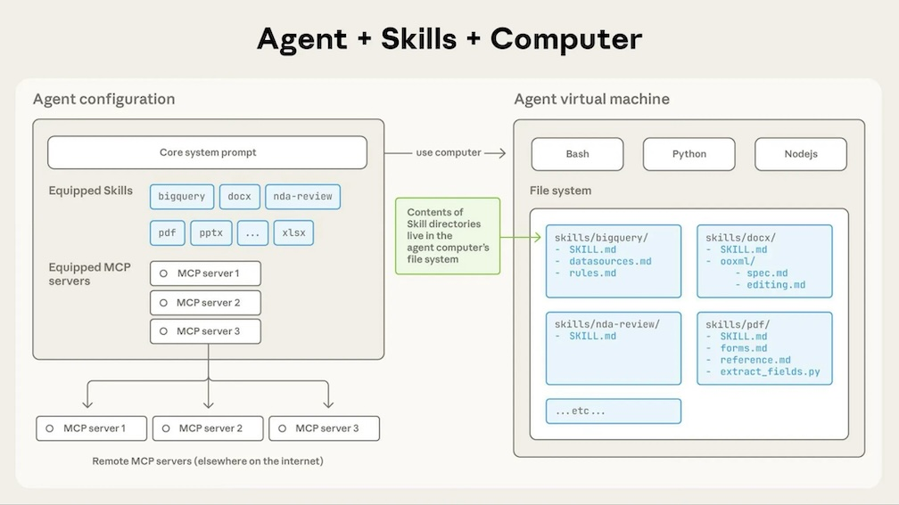
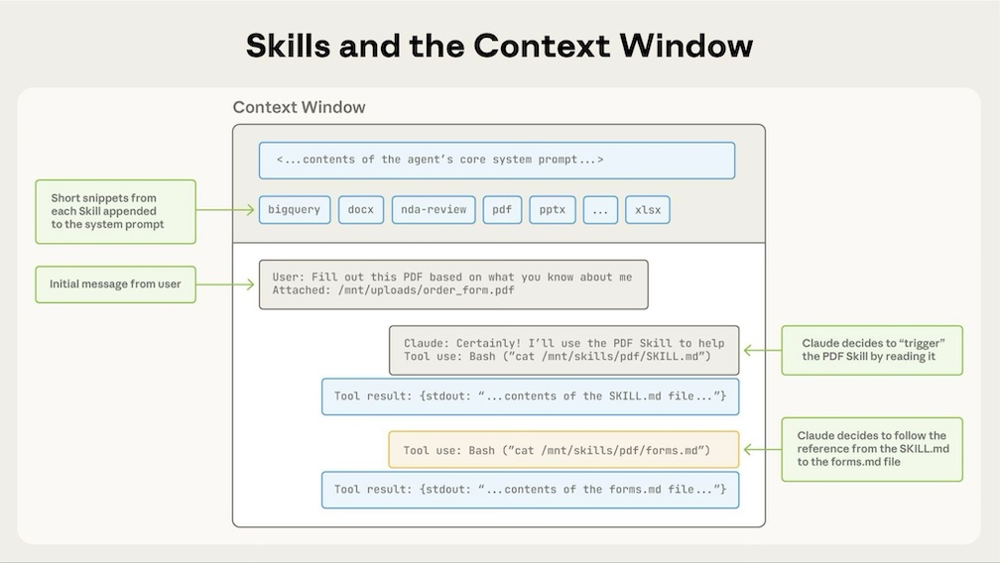

## Claude Skills vs MCP 

### What is Claude Skills and why to use it
- Specific + Repeatable tasks
    - i.e., "Design a nice frontend"
- Save Context
    - before --> Claude Rules (System Prompt)
    - after --> Claude Skills -> pick the right skill
- Easily Sharable
    - like AI SOP (Standard Operating Procedure, guide AI how to do things)
    - Create claude skill into zip file to share with others
    - Or create multiple sub-agents, each sub-agent can have sharable skills

### Skills architecture
- Skills run in a code execution environment where Claude has filesystem access, bash commands, and code execution capabilities. 
- Think of it like this: Skills exist as directories on a virtual machine, and 
- Claude interacts with them using the same bash commands you'd use to navigate files on your computer.



### How Claude accesses Skill content
- When a Skill is triggered, Claude uses bash to read `SKILL.md` from the filesystem, bringing its instructions into the `context window`. 
    - `SKILL.md`: main skill file with 2 components
        - Metadata: skill nme and description 
        - Body:c skill instructions in markdown format
- If those instructions reference other files (like FORMS.md or a database schema), Claude reads those files too using additional bash commands.
    - Additional files: more instructions that Claude can read as needed
    - i.e., within skill body there is `Ref: how-to-x.md` , claude calls skill --> read context from `how-to-x.md` 
    - Additional folders: logical organization of information for Claude to access as needed
- When instructions mention executable scripts, Claude runs them via bash and receives only the output
    - `Ref: script/foo.py` : claude calls skill  --> execute script `python script/foo.py` 

```
skill-name/
├── SKILL.md                    # Main skill file (metadata + body instructions)
├── FORMS.md                    # Additional instructions file (referenced in SKILL.md)
├── how-to-x.md                 # Additional instructions file (referenced in SKILL.md)
├── database-schema.sql         # Database schema file (referenced in SKILL.md)
├── config/
│   └── settings.json           # Configuration files organized in folder
├── templates/
│   └── template.html           # Template files organized in folder
└── scripts/
    └── foo.py                  # Executable script (referenced in SKILL.md)
```

- Progressive Disclosure
    - Give Claude just enough context for the next step
    - Level 1: SKILL.md metadat at start up, take ~100 tokens
    - Level 2: SKILL.md body, when Claude invokes the skill, <5k tokens
    - Level 3: Files and folders in skills direcftory, as needed by Claude, no limit




### Useful Claude agent skills
- `frontend-design` : 
- `payment-processing`: like stripe-integration
- 

### Skills vs MCP : differences and when to use them
| Aspect | Skills | MCP |
|--------|--------|-----|
| Purpose | Give tools + instructions to LLMs | Give tools + instructions to LLMs |
| Compatibility | Only work for Claude | Universal, open standard |
| Context Management | Progressive Disclosure, add context only when needed | All tools + metadata added at start so larger context window |
| Use Case | Teaching Claude how to do things with the available tools | Giving Claude access to complex tools and integrations |

## References
[Claude Docs on agent skills](https://platform.claude.com/docs/en/agents-and-tools/agent-skills/overview)  
[Agent Skills vs MCP: When to use each](https://www.youtube.com/watch?v=6wdvSH61xGw)  
[Claude Skills Explained in 23 Minutes](https://www.youtube.com/watch?v=vEvytl7wrGM)  
[Claude Skills Explained: 4 Skills to 10x Your Coding Workflow](https://www.youtube.com/watch?v=bFC1QGEQ2E8)  
[What are agent skills](https://medium.com/@tahirbalarabe2/what-are-agent-skills-c7793b206daf)  
[Claude Code plugins github](https://github.com/anthropics/claude-code/tree/main/plugins)  

