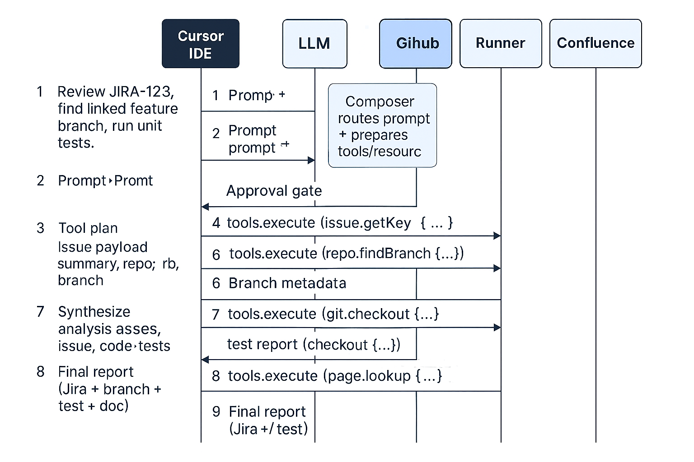

# Cursor coding agent interacting with MCP servers Example

## Concrete end‑to‑end call flow Example

- Let's break down into the details of call flows of a cursor IDE example. 
- Say I have mcp servers of our jira, confluence page setup as well as github repo. 
- I just send request to cursor to ask it review a jira ticket and then find the corresponding feature branch listed on jira it repo and run the unit test to verify the feature. 
- Can you please show me the details of call flow between cursor IDE, LLM , various mcp servers for above task?

- Cursor IDE with MCP servers for Jira, Confluence, and GitHub, plus a local Runner server to execute unit tests.
- Context reminders
    - Cursor is the `MCP host/client` that orchestrates one or more MCP server connections.
    - MCP servers expose `tools/resources/prompts` over transports like `stdio (local) or SSE/HTTP (remote)`. Cursor’s Composer agent can automatically use these tools (with your approval).

## High‑level sequence (Mermaid)

- Cursor initializes/maintains 1:1 MCP client connections to each server and exposes them to the LLM for tool use. [modelconte...rotocol.io]
- The Composer agent shows approval prompts before executing MCP tools, including arguments and responses. [cursor.com]
- Servers may elicit additional info mid‑flow (e.g., repo scope, credentials) and clients can specify roots (filesystem/repo boundaries) to scope access.



## Step‑by‑step call flow details

### Step A — User prompt enters Cursor

- `Initialize/Discover`: Cursor (host) has previously established connections to Jira, GitHub, Runner, Confluence via MCP handshake (protocol versions, capabilities).
- `Model routing`: Cursor forwards your prompt + available tool metadata to the LLM.
    - MCP defines clients/servers and transports; tool discovery happens after initialization.

### Step B — LLM plans tool usage

- The LLM proposes a plan:
    - Read Jira issue → Locate branch in GitHub → Checkout & run tests via Runner → Pull acceptance criteria from Confluence → Summarize.
    - MCP hosts (like Cursor) allow the model to execute tools the servers expose.

### Step C — Jira ticket retrieval (approval gate)

- Approval UI: Composer shows a tool call preview (e.g., Jira.issue.getByKey) and requests your approval. [cursor.com]
- Call: Cursor → Jira server over SSE/HTTP (or stdio):
    - Request: issue.getByKey({ key: "JIRA-123" })
- Response: Issue fields (summary, description, linked repo, labels like repo:acme/checkout, branch:feature/JIRA-123).
    - MCP uses JSON‑RPC message patterns (requests/results/errors/notifications) across transports like stdio or HTTP+SSE.

### Step D — GitHub branch discovery (approval gate)

- Approval UI: `GitHub.repo.findBranch`({ repo: "acme/checkout", query: "JIRA-123" }). [cursor.com]
- Call/Response: Branch metadata (name, last commit SHA, CI status).
    - If missing, the LLM may elicit more info (which repo, org) via client‑mediated prompts.

### Step E — Checkout & unit tests via Runner (approval gates)

- Approval UI: Runner.git.checkout({ repo, branch }) using stdio (local) or SSE (remote).
- Approval UI: Runner.test.run({ cmd: "npm test -- --reporter=junit" }).
- Call/Response: Structured test report (pass/fail, durations, coverage, failing specs, logs).
    - MCP clients can constrain access with roots (e.g., only the workspace dir), and servers can request additional info via elicitation (e.g., test command or environment).

### Step F — Confluence acceptance criteria

- Approval UI: Confluence.page.lookup({ query: "JIRA-123", space: "ENG" }).
- Response: Page snippets (ACs, notes) used as context in final reasoning.

### Step G — Final synthesis

- LLM aggregates Jira + GitHub + test output + Confluence ACs and generates the final report in Cursor.
    - MCP itself is about context/tooling—not about where the LLM runs; the LLM may be cloud or local endpoint.

## Example (simplified) MCP tool-call payloads

```json

// Jira: get issue by key
{
  "method": "tools/execute",
  "params": {
    "server": "jira",
    "tool": "issue.getByKey",
    "arguments": { "key": "JIRA-123" }
  }
}


// GitHub: find branch associated with issue key or label
{
  "method": "tools/execute",
  "params": {
    "server": "github",
    "tool": "repo.findBranch",
    "arguments": {
      "repo": "acme/checkout",
      "query": "JIRA-123"
    }
  }
}

// Runner: checkout & run tests
[
  {
    "method": "tools/execute",
    "params": {
      "server": "runner",
      "tool": "git.checkout",
      "arguments": {
        "repo": "/workspace/acme/checkout",
        "branch": "feature/JIRA-123"
      }
    }
  },
  {
    "method": "tools/execute",
    "params": {
      "server": "runner",
      "tool": "test.run",
      "arguments": { "cmd": "npm test -- --reporter=junit" }
    }
  }
]


```
