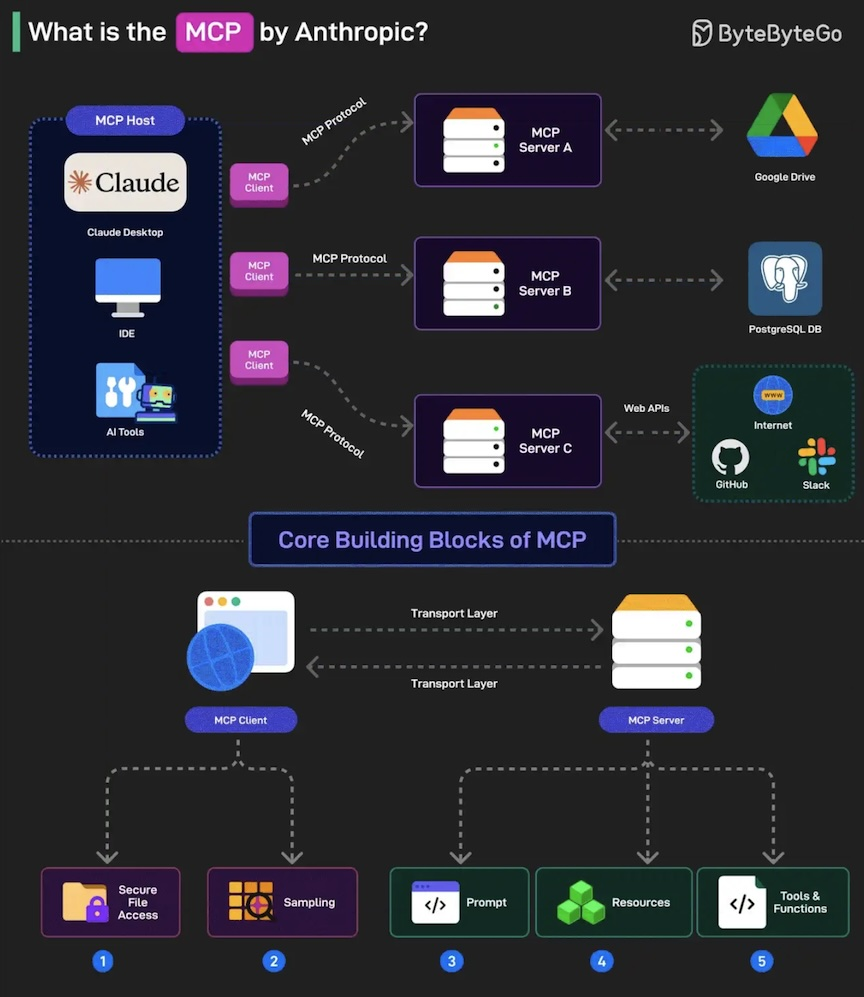

# Model Context Protocol (MCP)
- The **Model Context Protocol (MCP)** is an open standard designed to facilitate connections between AI agents and various data sources, such as
    - databases, 
    - APIs, 
    - and other external systems.
- MCP addresses the challenge of providing a standardized way for Large Language Models (LLMs) to connect with these external data sources and tools, enabling more dynamic and context-aware interactions 
- Essentially, MCP defines how applications and AI models exchange context information, allowing developers to integrate various data sources, tools, and functionalities consistently.
- Model Context Protocol is transforming AI by improving how models understand, store, and retrieve context dynamically. 
    - Whether for chatbots, LLMs, multi-agent AI, or vectorized knowledge bases, MCP enhances efficiency and responsiveness.

## What is MCP?

- Model Context Protocol (MCP), an open source project run by Anthropic, is an **emerging framework** that enables `structured and dynamic context management` for machine learning models, 
- MCP is particularly in applications involving 
    - conversational AI, 
    - large language models (LLMs), and 
    - multi-modal systems.
- This protocol is designed to provide better control, efficiency, and adaptability in real-time AI applications by managing the context dynamically based on user interactions and data flows.

## Key Features of Model Context Protocol

### Dynamic Context Switching
- Enables AI models to switch between different contexts based on predefined rules or user interactions.
### Memory Management 
- Efficiently handles long-term and short-term memory for contextual conversations.
### Optimized for LLMs
- Reduces token usage by maintaining only relevant context. 
### Multi-Agent Coordination
- Enables collaboration between multiple AI agents.
### Fine-Tuned Context Retrieval 
– Ensures only necessary context is fetched, improving response relevance.

## MCP core concepts

### Servers
- A **server** in MCP terms is anything that exposes resources or tools to the model. 
- For example, you might build a server that provides a “get_forecast” function (tool) or a “/policies/leave-policy.md” resource (file-like content).

### Clients
- A **client** is an `LLM-based interface` or tool (like Claude for Desktop or a code editor like Cursor) that can `discover and invoke MCP servers`. 
- This is how the user’s text prompts are turned into actual function calls without constantly switching between systems.

### Tools, resources, prompts
- Tools: Functions the model can call with user approval (e.g., createNewTicket, updateDatabaseEntry).
- Resources: File-like data the model can read, such as “company_wiki.md” or a dataset representing financial records.
- Prompts: Templated text that helps the model perform specialized tasks.

## References
[1] Model Context Protocol (MCP) Tutorial: https://dev.to/mehmetakar/model-context-protocol-mcp-tutorial-3nda  
[2] What is the Model Context Protocol (MCP)?: https://workos.com/blog/model-context-protocol  
[3] What is Model Context Protocol? (MCP) Architecture Overview: https://medium.com/@tahirbalarabe2/what-is-model-context-protocol-mcp-architecture-overview-c75f20ba4498  
[4] Github Model Context Protocol: https://github.com/modelcontextprotocol  
[5] Building MCP with LLMs： https://modelcontextprotocol.io/tutorials/building-mcp-with-llms   
[6] awesome-mcp-servers: A collection of MCP servers.:  https://github.com/punkpeye/awesome-mcp-servers  
[7] awesome-mcp-clients: A collection of MCP clients.:  https://github.com/punkpeye/awesome-mcp-clients  