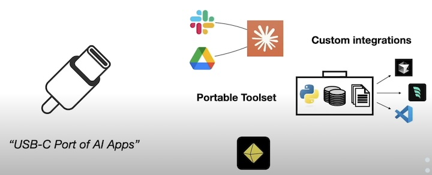
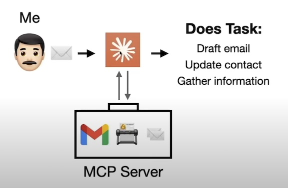

## Model Context Protocol (MCP) Explained
- Building an MCP server with Python

### What is MCP? 
- A standard way to connect tools and context to AI apps(like USB-C port of AI Apps)
 

### How MCP works?
- client-server architecture
- MCP Client
    - Built into AI Apps and send requests to MCP servers(e.g., Claude Desktop)
    - Client responsibilites:
        - Discover server capabilities
        - Receive data from servers
        - Manage LLM tool execution
- MCP Server
    - Listen for requests from MCP clients and respond accordingly
    - 3 key Services:
        - Prompt = prompt templates
        - Resource = data, filesystem, database, etc.
        - Tool = function, API, image processing, etc.
    - 2 Default Transports
        - Stdio(local)
        - HTTP with Server-Sent Events(SSE)(remote)

### Example: Building an MCP server with Python

- **Installing uv**
```shell
# Mac/Linux
curl -LsSf https://astral.sh/uv/install.sh | sh

# Windows
powershell -ExecutionPolicy ByPass -c "irm https://astral.sh/uv/install.ps1 | iex"
```
- **Creating Server**

```python 
from mcp.server.fastmcp import FastMCP
# Create an MCP server
mcp = FastMCP("AVA")
```

- **Adding Prompt**
```python
# Define prompts
@mcp.prompt()
def ava(user_name: str, user_title: str) -> str:
    """Global instructions for Artificial Virutal Assistant (AVA)"""
    with open("prompts/ava.md", "r") as file:
        template = file.read()
    return template.format(user_name=user_name, user_title=user_title)
```
- **Adding Resource**
```python
# Define resources
@mcp.resource("email-examples://3-way-intro")
def write_3way_intro() -> str:
    """Example of a 3-way intro email"""
    with open("email-examples/3-way-intro.md", "r") as file:
        return file.read()

@mcp.resource("email-examples://call-follow-up")
def write_call_followup() -> str:
    """Example of a call follow-up email"""
    with open("email-examples/call-follow-up.md", "r") as file:
        return file.read()

@mcp.resource("directory://all")
def get_directory() -> str:
    """Get the entire directory of contacts"""
    with open("directory.csv", "r") as file:
        return file.read()
```
- **Adding Tools**
```python
from tools.gmail import get_gmail_service
from googleapiclient.errors import HttpError
import base64
from email.message import EmailMessage
import os

# Define tools
@mcp.tool()
def write_email_draft(recipient_email: str, subject: str, body: str) -> dict:
    """Create a draft email using the Gmail API.
    
    Args:
        recipient_email (str): The email address of the recipient.
        subject (str): The subject line of the email.
        body (str): The main content/body of the email.
    
    Returns:
        dict or None: A dictionary containing the draft information including 'id' and 'message' 
                     if successful, None if an error occurs.
    
    Raises:
        HttpError: If there is an error communicating with the Gmail API.
        
    Note:
        This function requires:
        - Gmail API credentials to be properly configured
        - USER_EMAIL environment variable to be set with the sender's email address
        - Appropriate Gmail API permissions for creating drafts
    """
    try:
        # create gmail api client
        service = get_gmail_service()

        message = EmailMessage()

        message.set_content(body)

        message["To"] = recipient_email
        message["From"] = os.getenv("USER_EMAIL")
        message["Subject"] = subject

        # encoded message
        encoded_message = base64.urlsafe_b64encode(message.as_bytes()).decode()

        create_message = {"message": {"raw": encoded_message}}
        # pylint: disable=E1101
        draft = (
            service.users()
            .drafts()
            .create(userId="me", body=create_message)
            .execute()
        )

        print(f'Draft id: {draft["id"]}\nDraft message: {draft["message"]}')

    except HttpError as error:
        print(f"An error occurred: {error}")
        draft = None

    return draft
```
- **Local Transport**
```python
if __name__ == "__main__":
    mcp.run(transport='stdio')
```
- **Testing server**
    - ensure you have node installed
```shell
uv run mcp dev mcp-server-example.py
```
- Integrating into Claude Desktop
    - Download the latest version of the Claude Desktop app from the official website
    - Open the app and click on the "Settings" icon
    - Click on "MCP" in the settings menu
    - Click on "Add Server"
    - Enter the server's URL and port number
    - Click on "Save" to add the server to the list of available servers
    - Click on the server's name to connect to it
    - You should now be connected to the MCP server and can start using it to interact with LLM tools and resources


  


## References
[1] Model Context Protocol (MCP) Explained: https://www.youtube.com/watch?v=N3vHJcHBS-w  
[2] Medium: https://medium.com/data-science-collective/model-context-protocol-mcp-explained-ef5c33c5fe05  
[3] GitHub: https://github.com/ShawhinT/YouTube-Blog/tree/main/agents/4-mcp  
[4] Python MCP SDK: https://github.com/modelcontextprotocol/python-sdk  
[5] MCP Client Development Guide: https://github.com/cyanheads/model-context-protocol-resources/blob/main/guides/mcp-client-development-guide.md#1-introduction-to-mcp-clients  
