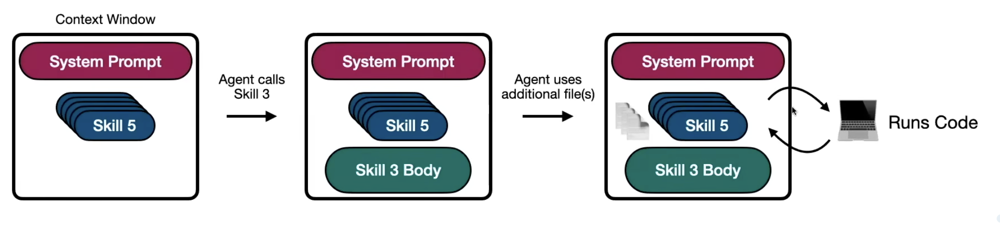

## Agent Skills vs MCP 

- AI models are getting smarter and smarter
    - GPQA improves from 30% to 85% in last 2 years
    - SWE-bench imporves from 18% to 80% in last 2 years
- Intelligence isn't the (only) bottleneck. LLMs are only as good as their tools and context 

### MCP (Model Context Protocol)

- A universal way to give LLMs tools and context
- First came out Nov. 2024
- likes **USB-C Port of AI Apps**
- Connect any AI app (claude, chatGpt, cursor,...) to any tools like Gmail, Slack, Notion, ..., etc.

### How MCP works

- Client-server architecture
- MCP client lives in AI App (Claude, ChatGpt, Cursor,...)
- MCP server 
    - Stores prompts
    - Resources (databases)
    - Tools (web search, read file)
- Problem with MCP
    - Token-heavy communication, response getting from MCP server (like list all tools) pretty verbose 
    - Heavy communication is necessary because AI app need to know enough context to understand
        - What tools are available
        - How they work
        - When they should be applied
        - What schema it should use to make tool call
        - All the context to give AI all the info it needs to use tools effectively
    - So there might be many irrelevant info for user's specific use case (like simple listing files) 
        - these irrelevant info does take up precious tokens, previous spaces in the context window
        - so it may rack up cost and affect performance as well. It's so called **context rot**
    - Agent skills can somehow help 

### Agent Skills 

- A folder with instructions accessed by agent as needed

```bash
skill-name/
    SKILL.md
```
- Two key parts of SKILL.md

    - `Frontmatter` : like metadata; loaded at startup; short descriptions of each skill it has
    - `Body` : additional instructions; agent only load after it learns from `Frontmatter` and calls actual skill. 

- Not limitted to this single file (SKILL.md). You can have additional folders
    - `references` - (optional) documentation
    - `assets`  - (optional) resources, templates
    - `scripts` - (optional) executable code

```bash
skill-name/
    SKILL.md
    references/
    assets/
    scripts/
```
- **Progressive Disclosure** : give agent just enough context for the next step



| Level   | Content                              | Enters context window…        | Tokens   |
|---------|--------------------------------------|--------------------------------|----------|
| Level 1 | SKILL.md metadata                    | On start up                    | ~100     |
| Level 2 | SKILL.md body                        | When agent invokes the skill   | < 5k     |
| Level 3 | Files and folders in skills directory| As needed by agent             | No limit |

### MCP vs Skills

**Similarities**

| MCP | Skills |
|-----|--------|
| Give tools + context to LLMs | Give context + code to agents |
| Open standard (widely adopted) | Open standard (early days) |

**Differences**

| MCP | Skills |
|-----|--------|
| All tool schemas on startup | Context & code loaded as needed |
| LLM needs MCP client + tool calling | LLM needs file tools + code interpreter |
| Custom server requires coding | Custom skills only need natural language |

**Use cases**

| MCP | Skills |
|-----|--------|
| Giving agent access to specialized tools | Teaching agent how to use tools for specific tasks |
| Example: Connecting Claude to Notion | Example: Executing tasks using Notion |

## Referrences
[awesome-mcp-servers](https://github.com/punkpeye/awesome-mcp-servers)  
[awesome-claude-skills](https://github.com/ComposioHQ/awesome-claude-skills)  
[MCP server from Anthropic](https://github.com/modelcontextprotocol/servers)  
[Anthropics Skills](https://github.com/anthropics/skills)  
