# Containers in Google Cloud 

## Container fundamentals
- What is a container?  A container is an invisible box around your code and its dependencies, with limited access to its own partition of the file system and hardware.
- What makes containers flexible?  A container virtualizes the OS and dependencies to make your code ultra portable. This allows you to “code once and run anywhere”.
- How do you develop application code?  You develop on hardware, while executing your final code on VMs free from typical software dependencies.

### Container images
- An application and its dependencies are called an image.
- A container is a running instance of an image.
- Building software into container images, means you can easily package and ship an application.
- Docker is a open-source software in which you can build and run container images.

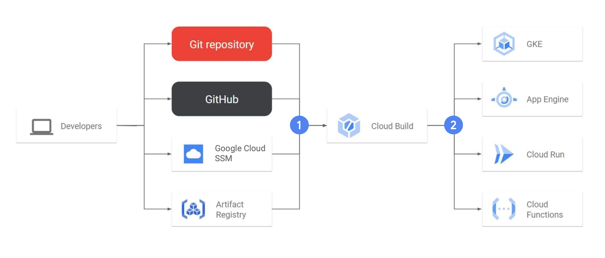 

## Google Kubernetes Engine

### Orchestrating containers with Kubernetes
- Kubernetes basics
	- Kubernetes is an open-source platform for managing containerized workloads and services.
	- It is a set of APIs for deploying containers on a set of nodes called a cluster.
	- It is declarative, allowing you to describe a set of applications and how they should interact.
- Kubernetes features 
	- Workload types 
		- Supports stateless and stateful applications 
		- Supports batch jobs
	- Autoscaling
		- Automatically scales in and out containerized applications based on resource utilization and daemon tasks
	- Resource controls 
		- Specify resource request levels and resource limits for your workloads
	- Portability
		- Supports workload portability across on-premises or multiple cloud service providers
		- Deploy anywhere and move workloads without vendor lock-in

### Kubernetes concepts: Pod
- A Pod is the smallest unit in Kubernetes that you create or deploy.
	- Represents a running process on your cluster
	- Provides a unique network IP address and set of ports for your containers and configurable options

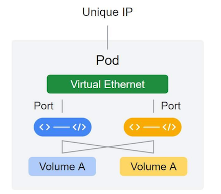

### Kubernetes concepts: Deployment
- A Deployment represents a group of replicas of the same Pod and keeps your Pods running even when the nodes they run on fail.

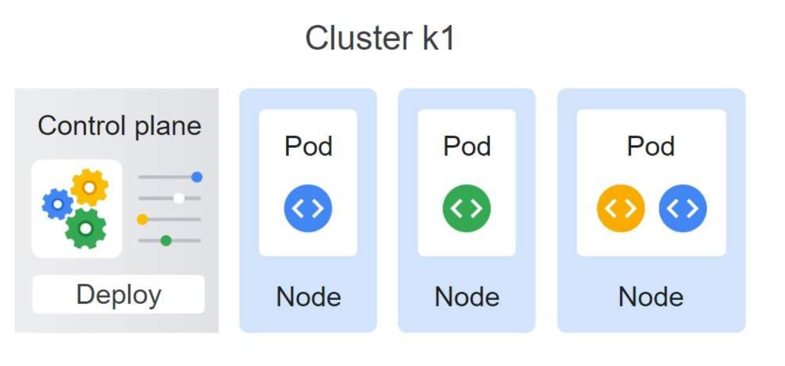

### Kubernetes concepts: Service
- A Service is an abstraction that defines a logical set of Pods and a policy by which to access them.
	- Kubernetes creates a Service with a fixed IP address for your Pods.
	- A Service group is a set of Pods and provides a stable endpoint (or fixed IP address) for them.

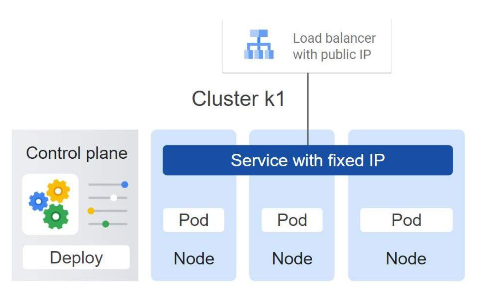

### Declarative configurations
- Kubernetes’ key strength is that it allows you to work in a declarative way.
- You provide Kubernetes with a config file that outlines your desired state; then, it determines how to achieve that state.
- This is best achieved by using a Deployment config file.
- You can update your app using the command
line or by updating the config file.

## Google Kubernetes Engine

### GKE and EKS: Similarities
- GKE and EKS are both based on Kubernetes.
- Use a cluster of VMs to run and manage containers
- Use a cluster of VMs to run and manage containers
- Node agents are Kubelets
- Group containers by Pods
- Can run on a variety of clouds as well as physical hardware and VMs
- Support containerd container runtimes on Kubernetes 1.24 or later
- Support Docker container runtimes if running a Kubernetes version older than 1.24

### GKE and EKS: Differences

| Feature | AWS EKS | Google GKE |
|---------|---------|------------|
| **Running commands** | Done through a combination of kubectl, AWS CLI, and the Amazon EKS command line tool eksctl | Done through a combination of the open source kubectl command line and the gcloud CLI |
| **Auto-repair nodes** | EKS Auto Mode helps keep the nodes in your EKS cluster in a healthy, running state | Node auto-repair helps keep the nodes in your GKE cluster in a healthy, running state |
| **Control plane upgrades** | Node auto-upgrades keep the nodes in your cluster up-to-date with the cluster control plane version when your control plane is updated on your behalf | Node auto-upgrades keep the nodes in your cluster up-to-date with the cluster control plane version when your control plane is updated on your behalf |

## Kubernetes architecture
- GKE cluster architecture
### Control plane: 
- Overview and Kubernetes API
	- The control plane runs processes such as the Kubernetes API server, scheduler, and core resource controllers.
	- GKE manages the control plane lifecycle from cluster creation to deletion.
	- The control plane is the unified endpoint for your cluster.
	- You interact with the control plane through `Kubernetes API calls`, which you make through:
		- Direct calls
		- Indirect calls
	- The API server process is the hub for all communication for the cluster.
- Node interaction and Artifact registry
	- Node interaction
		- The control plane:
		- Manages what runs on all of the cluster's nodes
		- Schedules and manages workloads
		- Manages network and storage resources
		- Control plane and nodes communicate with each other using Kubernetes APIs
	- Artifact Registry
		- GKE pulls container images from the ‘pkg.dev’ Artifact Registry.
		- Outages affecting these registries might cause the following actions to fail:
			- New cluster creation
			- Cluster version upgrades
		- Disruptions to workloads might occur even without your intervention.
### Nodes
- GKE creates individual Compute Engine virtual machines (VMs) that run your containerized applications and other workloads.
- A node runs the services necessary to support the containers that make up your cluster's workloads.
- System containers that run as per-node agents, called DaemonSets, provide log collection, intra-cluster network connectivity and other functionality.
- Use ‘stdout’ for containerized applications because it lets your platform handle the application logs.

## Kubernetes components
### Pods
- Pods are the basic building block of the standard Kubernetes model, and they’re the smallest deployable Kubernetes object.
- Pods embody the environment where the containers live.
- Multiple containers in a pod are tightly coupled and share resources.
- Each Pod is assigned a unique IP address.
- Every container within a Pod shares the network namespace.

### Clusters
- Your cluster needs computers (usually VMs).
- One computer is called the “control plane” and the others are called “nodes”.
- The control plan coordinates the entire cluster.
- The nodes run Pods.

### Control plane
- `kubectl command`: Connects to and communicates with kube-APIserver
- `kube-APIserver`: Accepts commands that view or change the state of the cluster
- `etcd`: Reliably stores the state of the cluster 
- `kube-cloud-manager`: Manages controllers that interact with underlying cloud providers
- `kube-scheduler`: Schedules Pods onto the nodes
- `Kube-controller-manager`: Monitors the state of a cluster and makes changes to achieve the desired state 

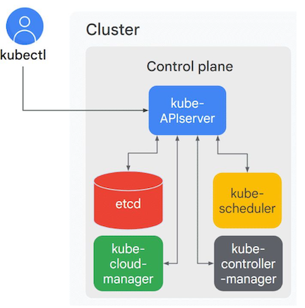

### Nodes

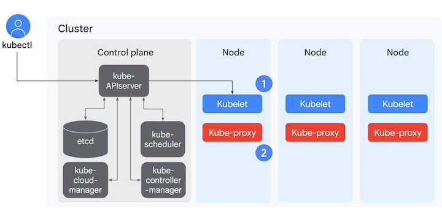

## Object management: Manifest files
- Creating and identifying objects using manifest files
	- API version: Describes which Kubernetes API version is used to create the object
	- Kind: Identifies the object you want 
	- Metadata: Helps identify the object using
```bash
Name, Unique ID, and an optional Namespace
apiVersion: v1
kind: Pod
metadata:
	name: nginx
	labels:
		app: nginx
spec:
	containers:
	- name: nginx
		image: nginx:latest
```
- Best practice tips for YAML files
	- Define several related objects in the same YAML file
	- Save your YAML files in version-controlled repositories, which helps to:
		- Track, manage and backout changes
		- Recreate or restore a cluster

### Controller objects
- Challenges with managing objects
	- Managing multiple pods independently using separate YAML files can be challenging and increase complexity.
	- Pods have a limited life cycle.
	- They don’t heal or repair themselves.
- Use an object controller to manage the state of the pods and ensure high availability along with horizontal scaling.
	- For example:
		- Deployments
		- StatefulSets
		- DaemonSets
		- Jobs

#### Deployement 
- A Deployment ensures that a defined set of Pods is running at any given time.
- Specify:
	- How many replica pods you want
	- How Pods should run
	- Which containers should run within these Pods
	- Which Volumes should be mounted

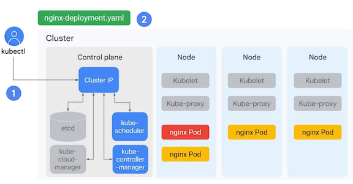

## The kubectl command
### What is kubectl
- kubectl is a utility used by administrators to control Kubernetes clusters.
	- It transforms your command-line entries into API calls.
	- It must be configured with the location and credentials of a Kubernetes cluster.
- Use it to
	- Create, view and delete Kubernetes objects
	- View or export configuration files

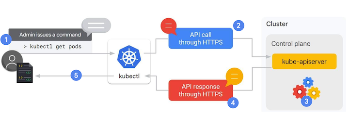

### Configuring kubectl 
#### The kubectl 'config view' command
- kubectl must be configured before you can use it in your cluster.
- Configurations are stored in a hidden .kube directory in your home directory.
- The directory contains the list of clusters and the credentials for each.
- Open the config file or use the `config view` command to view it.
#### The gcloud 'get-credentials' command
- Retrieve your credentials to connect a GKE cluster with kubectl.
- The gcloud ‘get-credentials’ command writes configuration information for the config file in the .kube directory in the $HOME directory (default).
- A configured file is automatically referenced and connected without requiring credentials for a new cluster.
- kubectl can’t create new clusters or change the shape of existing clusters - use the GKE control plane for this.
- This command gives you the credentials you need to connect with a GKE cluster.
```bash
kubectl get
kubectl list

kubectl get pods
kubectl get pods -o=wide
kubectl get pods my-test-app
kubectl get pods my-test-app -o=yaml
kubectl get deployment
```
### Concepts specific to GKE
#### Control plane management
- Nodes and node pools
	- Cluster administrators create nodes and add them to Kubernetes (GKE automates this process).
	- Nodes run on Compute Engine and you choose your node machine type:
		- Customize your nodes’ number of cores and their memory capacity, or
		- Select a CPU platform, or
		- Choose a baseline minimum CPU platform for the nodes or node pool.
	- A node pool is a subset of nodes within a cluster that share a configuration.
	- They provide an easy way to ensure that workloads run on the right hardware within your cluster.
	- At node pool level you can enable:
		- Automatic node upgrades and repairs
		- Cluster autoscaling
	- Available for GKE Standard mode only.
- Zonal and regional clusters: Zone
	- Available for GKE Standard mode only.
	- By default, a cluster launches in a single Google Cloud compute zone with three identical nodes, all in one node pool.
	- Change the number of nodes during or after the creation of the cluster.
	- Additional nodes and deploying multiple replicas of an application will improve an application’s availability, to a point.
- Zonal and regional clusters: Region
	- Available for GKE Standard and Autopilot modes only
	- Regional clusters have a single API endpoint for the cluster.
	- A cluster’s control planes and nodes are spread across multiple Compute Engine zones within a region.
	- This maintains the availability of the application and control plane across multiple zones in a region.
<div style="display: flex; align-items: flex-start;">
  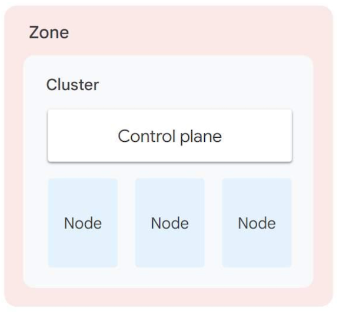
  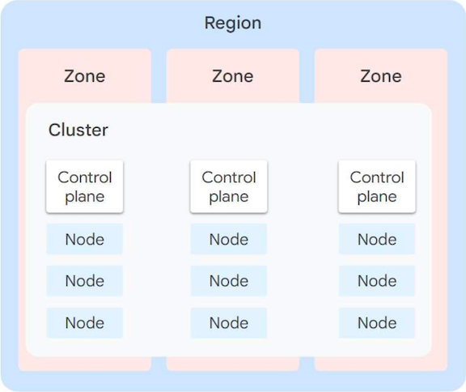
</div>

## Deployments and Networking

### Declaring the state of Pods
- Deployment kind and name: The Deployment named my-app is created with three replicated Pods.
- Spec.template: A Pod template defines the metadata and specification of each of the Pods in this ReplicaSet.
- Pod specification: An image is pulled from Google Container Registry, and port 8080 is exposed to send and accept traffic for the container.

### Deployment lifecycle states
- Progressing state: A task is being performed.
- Complete state: All replicas have been updated and are available.
- Failed state: A new ReplicaSet could not becompleted.
- Keeping your YAML files in a source code repository will help you manage some of the complexity of tracking fixes and revisions.

### Creating Deployments 
- Create the Deployment declaratively using a manifest file and a kubectl 'apply' command.
```bash
kubectl apply -f [DEPLOYMENT_FILE]
```
- Create a Deployment imperatively using a kubectl 'create deployment' command that specifies the parameters inline.
```bash
kubectl create deployment \
[DEPLOYMENT_NAME] \
	--image [IMAGE]:[TAG] \
	--replicas 3\
	--labels [KEY]=[VALUE] \
	--ports 8080 \
	--generator deployment/apps.v1 \
	--save-config
```
- Use the GKE Workloads menu in the Cloud Console where you can:
	- Specify the container image and version, or select it directly from Container Registry.
	- Specify environment variables and initialization commands.
	- Add an application name, namespace and labels.
	- Use the View YAML button to view the Deployment specification in YAML format.

### Inspect the state of a Deployment: kubectl and Cloud Console
```bash
kubectl get deployment [DEPLOYMENT_NAME]

kubectl get deployment nginx-deployment

NAME READY UP-TO-DATE AVAILABLE AGE
nginx-deployment 3/3 3 3 18s

kubectl get deployment [DEPLOYMENT_NAME] -o yaml > this.yaml

```

### Scale a Deployment: Manually and autoscaling
- To manually scale a Deployment:
	- Use a `kubectl` command.
	- Define the total number of repl
	- Change the manifest manually.
- To autoscale a Deployment:
	- Specify the minimum and maximum number of desired Pods and CPU utilization threshold.
	- Use the kubectl 'autoscale' command or Cloud Console.
```bash
kubectl autoscale deployment [DEVELOPMENT_NAME] \
	--min=1 --max=3 \
	--cpu-percent=80
```

### Updating Deployments
#### Ways to update deployments
- kubectl ‘apply’ : Update other specifications of a Deployment.
- kubectl ‘set’ : Change the Pod template specifications for the Deployment.
- kubectl ‘edit’ : Open the specification file using the vim editor to make changes directly.
- Cloud Console : Edit the Deployment manifest from the Cloud Console to perform a rolling update, and more.

#### Update strategies: 
- Rolling update
  
  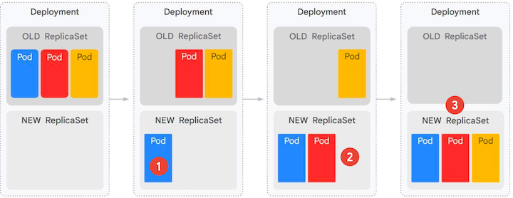

- Blue/green

  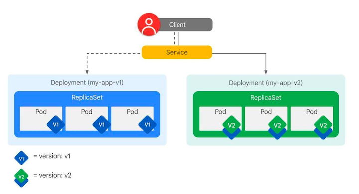

- Canary
	- The Service selector is based only on the application label and does not specify the version.
	- This setting allows the Service to select and direct the traffic to the Pods from both Deployments.
	- A subset of users will be directed to the new version.
	- May require tools such as Istio to accurately shift the traffic.

<table>
<tr>
<td>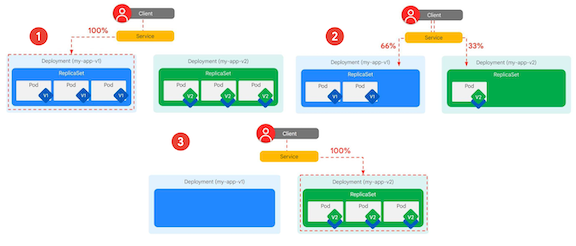</td>
<td>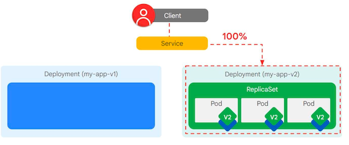</td>
</tr>
</table>

- Session affinity
	- A Service configuration does not normally ensure that all requests from a single client will always connect to the same Pod.
	- To prevent this, set the sessionAffinity field to ClientIP in the specification of the service if you need a client's first request to determine which Pod will be used for all subsequent connections.
- A/B testing
	- Test a hypothesis by using variant implementations.
	- To perform an A/B test, you route a subset of users to new functionality based on routing rules.
	- A/B testing is best used to measure the effectiveness of functionality in an application.

  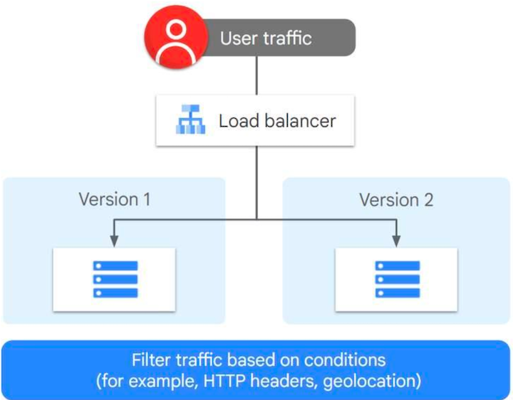

- Shadow testing
	- Deploy and run a new version alongside the current version.
	- An incoming request is mirrored and replayed in a test environment.
	- Ensure the shadow tests do not trigger side effects that can alter the existing production environment or the user state.
	- It’s typically combined with other approaches like canary testing.
	- Shadow testing offers many benefits.

  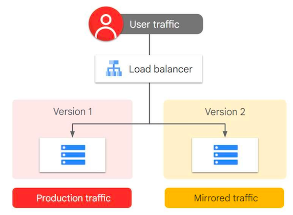

### Rolling back Deployments
- Use the `kubectl rollout undo` command to return to a previous version, ensuring that you specify the revision number.
- Inspect the rollout history using the `kubectl rollout history`command.
- Start Cloud Shell from your Console to input these commands.
- By default, the details of 10 previous ReplicaSets are retained, but you can change this limit under the Deployment specification.

### Deployment actions
- ‘rollout pause’ : Use the `kubectl rollout pause` command to allow the initial state of the Deployment to continue its function, while new updates will not have any effect while the rollout is paused.
- ‘rollout resume’ : Use the `kubectl rollout resume` command to roll out new changes with a single revision.
- 'rollout status' : Use the `kubectl rollout status` command to monitor the rollout status.
- 'delete' : Use the `kubectl delete` command to delete a Deployment and delete it from Cloud Console.

#### Example: kubectl rollout status command

```bash
kubectl rollout status deployment/my-app
```

**Output during a successful rollout:**
```
Waiting for deployment "my-app" rollout to finish: 1 of 3 updated replicas are available...
Waiting for deployment "my-app" rollout to finish: 2 of 3 updated replicas are available...
deployment "my-app" successfully rolled out
```

**Output when rollout is complete:**
```
deployment "my-app" successfully rolled out
```

**Output when rollout is paused:**
```
Waiting for deployment "my-app" rollout to finish: 1 out of 3 new replicas have been updated...
deployment "my-app" rollout is paused
```

## Pod networking

### Pod-to-Pod communication on the same node

  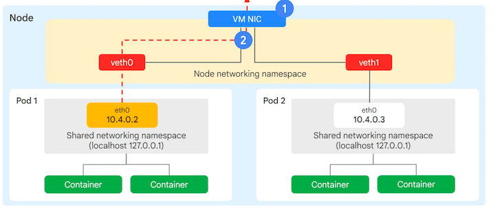

### Pod IP addresses in GKE
- AWS : With the Amazon VPC CNI plugin, each pod is assigned an IP from the primary or secondary CIDR blocks of the VPC.
- The container network interface uses existing VPC networking.
- GKE: Nodes obtain the Pod IP addresses from secondary/alias IP address ranges assigned to your Virtual Private Cloud, or VPC.
- When you deploy GKE, you can select a VPC along with a region or zone.

### Alias IPs
- An Alias IP range is reserved for approximately 4,000 IP addresses for cluster-wide services that you may create later.
- A separate Alias IP range is created for entire clusters of Pod IPs in range /14 (> 250,000 IPs).
- A much smaller /24 block is allocated to each node (256 IP addresses). For each node, the Pod IP range /24 allows GKE to assign the IP address to individual Pods.

## Example: Start a Kubernetes cluster managed by Kubernetes Engine 

### Set project

```bash 
gcloud config set project qwiklabs-gcp-04-d01c2c70cc92
Updated property [core/project].
```

### Update env MY_ZONE and create clusters 
```bash
export MY_ZONE=us-central1-a
gcloud container clusters create webfrontend --zone $MY_ZONE --num-nodes 2
```
```bash
kubeconfig entry generated for webfrontend.
NAME: webfrontend
LOCATION: us-central1-a
MASTER_VERSION: 1.33.4-gke.1036000
MASTER_IP: 34.28.52.168
MACHINE_TYPE: e2-medium
NODE_VERSION: 1.33.4-gke.1036000
NUM_NODES: 2
STATUS: RUNNING
STACK_TYPE: IPV4
```
- Start a Kubernetes cluster managed by Kubernetes Engine. 
- Name the cluster webfrontend and configure it to run 2 nodes:
- It takes several minutes to create a cluster as Kubernetes Engine provisions virtual machines for you.

### After the cluster is created, check your installed version of Kubernetes
```bash
kubectl version 
```

### Run and deploy a container
```bash
kubectl create deploy nginx --image=nginx:1.17.10
```
```bash
deployment.apps/nginx created
```
- In Kubernetes, all containers run in pods. 
- This use of the kubectl create command caused Kubernetes to create a deployment consisting of a single pod containing the nginx container. 
- A Kubernetes deployment keeps a given number of pods up and running even in the event of failures among the nodes on which they run. 
- In this command, you launched the default number of pods, which is 1.

### View the pod running the nginx container
```bash
kubectl get pods
NAME                     READY   STATUS    RESTARTS   AGE
nginx-5d7f755ff7-bmb8v   1/1     Running   0          73s
```

### Expose the nginx container to the Internet
```bash
kubectl expose deployment nginx --port 80 --type LoadBalancer
```
```bash
service/nginx exposed
```

- Kubernetes created a service and an external load balancer with a public IP address attached to it. 
- The IP address remains the same for the life of the service. 
- Any network traffic to that public IP address is routed to pods behind the service: in this case, the nginx pod.

### View the new service:
```bash
kubectl get services
```
```bash
NAME         TYPE           CLUSTER-IP      EXTERNAL-IP    PORT(S)        AGE
kubernetes   ClusterIP      34.118.224.1    <none>         443/TCP        7m59s
nginx        LoadBalancer   34.118.225.33   34.31.94.162   80:30169/TCP   79s
```
- You can use the displayed external IP address to test and contact the nginx container remotely.
- It may take a few seconds before the External-IP field is populated for your service. 
- This is normal. Just re-run the kubectl get services command every few seconds until the field is populated.

### Scale up the number of pods running on your service
```bash
kubectl scale deployment nginx --replicas 3
kubectl get pods
kubectl get services
```
- Scale up the number of pods running on your service
- Confirm that Kubernetes has updated the number of pods:
- Confirm that your external IP address has not changed:
- Return to the web browser tab in which you viewed your cluster's external IP address. 
- Refresh the page to confirm that the nginx web server is still responding.


