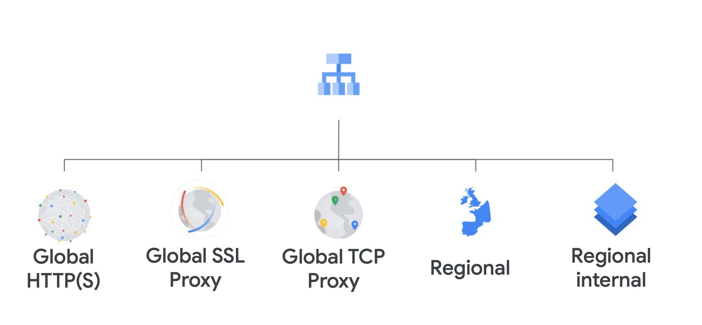
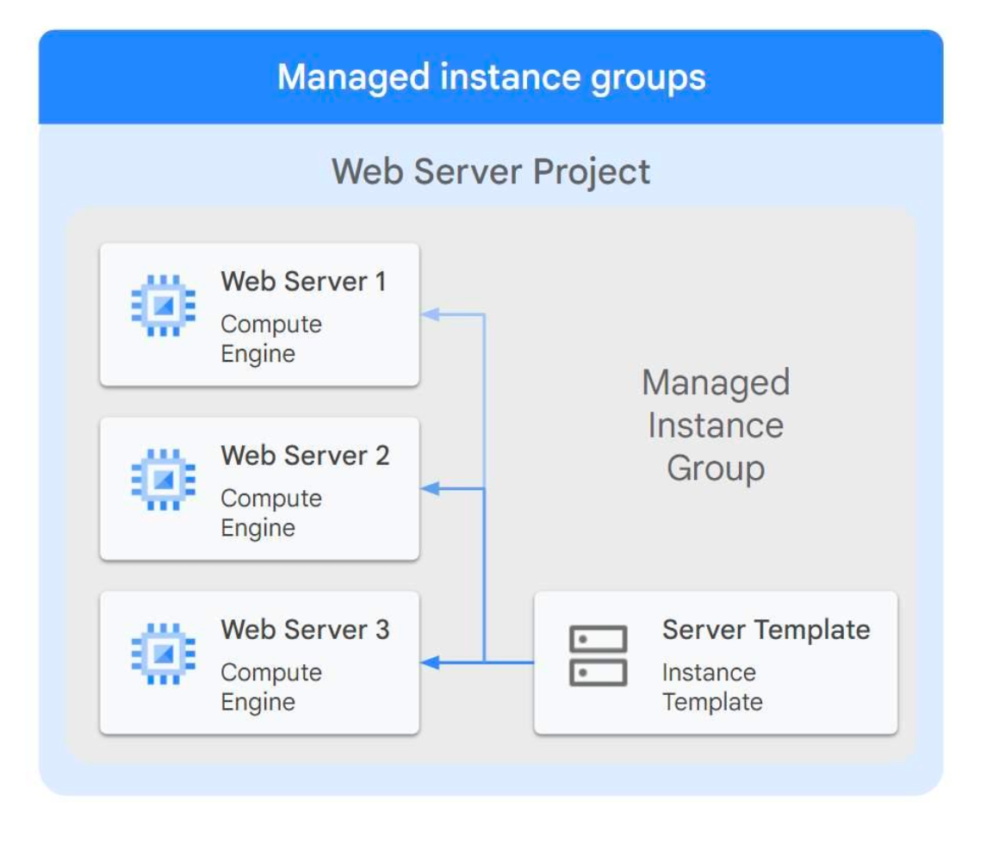
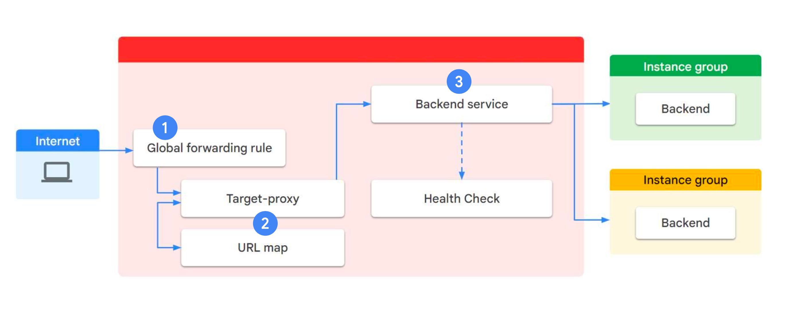
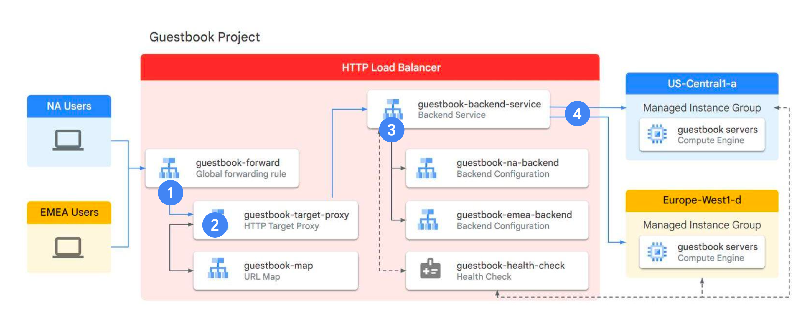
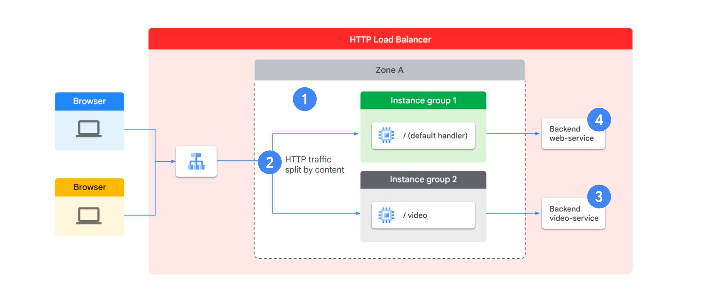
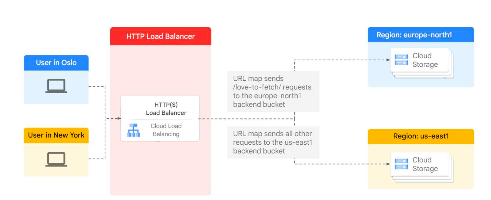

# Load Balancing and Managed Instance Groups on Google Cloud

## Table of contents

- [Part 1: Load Balancing in AWS vs Google Cloud](#part-1-load-balancing-in-aws-vs-google-cloud)
	- [Key Differences](#key-differences)
- [Part 2: Google Cloud Load Balancing Features](#part-2-google-cloud-load-balancing-features)
	- [Types of Load Balancers](#types-of-load-balancers)
		- [Global Load Balancers](#global-load-balancers)
		- [Regional Load Balancers](#regional-load-balancers)
	- [Network Endpoint Groups (NEG)](#network-endpoint-groups-neg)
	- [Load Balancer Selection Criteria](#load-balancer-selection-criteria)
- [Part 3: Managed Instance Groups (MIGs)](#part-3-managed-instance-groups-migs)
	- [What are MIGs?](#what-are-migs)
	- [MIG Types](#mig-types)
		- [Regional vs Zonal MIGs](#regional-vs-zonal-migs)
		- [Managed vs Unmanaged Instance Groups](#managed-vs-unmanaged-instance-groups)
	- [Creating MIGs: 6-Step Process](#creating-migs-6-step-process)
	- [Autoscaling Policies](#autoscaling-policies)
	- [Health Checks](#health-checks)
- [Architecture Examples](#architecture-examples)
	- [HTTP(S) Load Balancer Components](#https-load-balancer-components)
	- [Cross-Region Load Balancing](#cross-region-load-balancing)
	- [Content-Based Routing](#content-based-routing)
- [Best Practices](#best-practices)
	- [Load Balancer Selection](#load-balancer-selection)
	- [MIG Configuration](#mig-configuration)
	- [Security Considerations](#security-considerations)
- [Lab Overview](#lab-overview)
- [Configuring an HTTP Load Balancer with Autoscaling](#configuring-an-http-load-balancer-with-autoscaling)
	- [Tasks](#tasks)

## Part 1: Load Balancing in AWS vs Google Cloud

### Key Differences

| Feature | AWS | Google Cloud |
|---------|-----|--------------|
| **Global Load Balancing** | Not offered | Available - manage traffic globally instead of regionally |
| **Load Balancer Types** | Function-specific load balancers | Protocol-specific load balancers |
| **SSL/TLS Support** | Supports Transport Layer Security (TLS) | HTTP(S) Load Balancing available |
| **Certificate Management** | Automatic via Certificate Manager | Automatic via Certificate Manager |

## Part 2: Google Cloud Load Balancing Features

### Types of Load Balancers

#### Global Load Balancers
- **HTTP(S) Load Balancer**: For web applications
- **SSL Proxy**: For SSL traffic termination
- **TCP Proxy**: For TCP traffic
- **Use Cases**: Globally distributed users and instances, single anycast IP address

#### Regional Load Balancers
- **Network Load Balancer**: Uses Maglev for TCP/UDP traffic
- **Internal Load Balancer**: Uses Andromeda for internal traffic
- **Internal HTTP(S)**: Proxy-based Layer 7 load balancer
- **Use Cases**: Regional traffic distribution, internal communications

 

### Network Endpoint Groups (NEG)

Four types of NEGs:
1. **Zonal**: IP addresses or IP:port combinations in specific zones
2. **Internet**: Committed usage terms for cost savings
3. **Hybrid Connectivity**: Traffic Director services outside Google Cloud
4. **Serverless**: Cloud Run, App Engine, or Cloud Functions services

### Load Balancer Selection Criteria

Consider these factors when choosing a load balancer:
- Load balancer type (global vs regional)
- Traffic type (HTTP/HTTPS, TCP, UDP)
- External or internal traffic
- IPv6 support requirements
- Port requirements

## Part 3: Managed Instance Groups (MIGs)

### What are MIGs?

MIGs are collections of identical VM instances controlled as a single entity using an instance template. They provide:

- **Automatic scaling** based on demand
- **Health monitoring** and automatic instance replacement
- **Rolling updates** across all instances
- **Load distribution** across multiple zones for high availability

### MIG Types

#### Regional vs Zonal MIGs
- **Regional MIGs** (recommended): Distribute load across multiple zones for better availability
- **Zonal MIGs**: Limited to single zone, suitable for specific use cases

#### Managed vs Unmanaged Instance Groups
- **Managed**: Use instance templates, support autoscaling and auto-healing
- **Unmanaged**: Manual management, heterogeneous instances, basic load balancing only

### Creating MIGs: 6-Step Process

1. **Select MIG Type**: Choose between stateless or stateful managed instance groups
2. **Configure Name and Description**: Set basic identification
3. **Choose Location**: Select single zone or multiple zones (recommended)
4. **Select Instance Template**: Define the VM configuration
5. **Configure Autoscaling**: Set up automatic scaling policies
6. **Set Health Checks**: Configure monitoring for auto-healing

### Autoscaling Policies

MIGs support scaling based on:
- **CPU utilization**: Scale when CPU usage exceeds thresholds
- **Load balancing capacity**: Scale based on backend capacity
- **Cloud Monitoring metrics**: Custom metrics-based scaling
- **Pub/Sub queues**: Queue-based workload scaling

### Health Checks

Two types with different purposes:
- **Load Balancing Health Checks**: More aggressive, redirect traffic from unhealthy instances
- **MIG Health Checks**: More conservative, trigger instance replacement when unhealthy

## Architecture Examples

### HTTP(S) Load Balancer Components
1. **Global Forwarding Rule**: Entry point for traffic
2. **Target Proxy**: Handles SSL termination and routing
3. **URL Map**: Routes requests based on URL patterns
4. **Backend Services**: Manage instance groups and health checks
5. **Instance Groups**: Collections of backend instances

### Cross-Region Load Balancing
- Users from different regions (NA, EMEA) access same application
- Traffic routed to nearest healthy backend
- Automatic failover between regions

### Content-Based Routing
- Single load balancer routes different URLs to different backends
- Example: `/video` requests go to video processing instances
- Default route handles general web traffic

## Best Practices

### Load Balancer Selection
1. Determine if you need global or regional load balancing
2. Identify traffic type (HTTP/HTTPS, TCP, UDP)
3. Consider whether traffic is external or internal
4. Plan for IPv6 support if needed
5. Configure appropriate SSL certificates

### MIG Configuration
1. Use regional MIGs for better availability
2. Configure conservative health checks for auto-healing
3. Set appropriate autoscaling policies based on application needs
4. Use instance templates for consistent deployments
5. Plan for gradual rolling updates

### Security Considerations
- Use HTTPS load balancers with proper SSL certificates
- Configure appropriate firewall rules
- Implement proper health check endpoints
- Use internal load balancers for backend services

## Lab Overview

The module includes a hands-on lab where you will:
- Configure an HTTP load balancer with autoscaling
- Create managed instance groups in multiple regions
- Test load balancing and autoscaling behavior
- Observe global traffic distribution

This practical exercise reinforces the concepts learned and provides experience with Google Cloud's load balancing solutions.

## Configuring an HTTP Load Balancer with Autoscaling 
- Google Cloud HTTP(S) load balancing is implemented at the edge of Google's network in Google's points of presence (POP) around the world. 
	- User traffic directed to an HTTP(S) load balancer enters the POP closest to the user 
	- and is then load-balanced over Google's global network to the closest backend that has sufficient available capacity.

### Tasks 
- Create a health check firewall rule
- Create a NAT configuration using Cloud Router
- Create a custom image for a web server
- Create an instance template based on the custom image
- Create two managed instance groups
- Configure an HTTP load balancer with IPv4 and IPv6
- Stress test an HTTP load balancer

https://www.cloudskillsboost.google/classrooms/31136/labs/255337/materials
